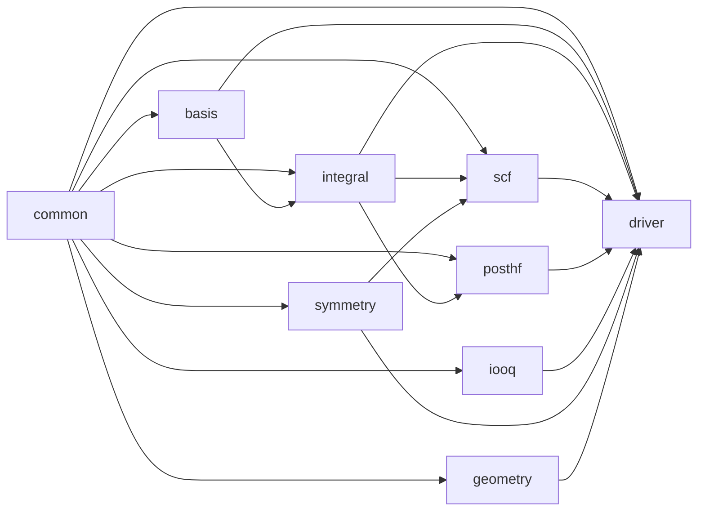

<p align="center">
  <a href="https://github.com/lenhanpham/OpenQuantum">
    <picture>
      
    </picture>
  </a>
</p>
<p align="center">
  <a href="https://www.rust-lang.org/">
    
  </a>
  <a href="./LICENSE">
    
  </a>
  <a href="https://github.com/lenhanpham/OpenMECP/actions/workflows/build.yml">
    
  </a>
</p>

OpenQuantum is an ab initio molecular orbital (MO) calculation program written in Rust.
It performs Hartree-Fock and post-Hartree-Fock calculations within the Linear Combination
of Atomic Orbitals (LCAO) framework. Supports RHF, UHF, and ROHF for closed- and open-shell
molecules, MP2 and CCSD(T) correlation energies, geometry optimization (BFGS, Berny RFO,
primitive/DLC/TRIC internal coordinates) with analytic gradients, IRC and NEB pathways,
harmonic frequency analysis with analytical Hessians and thermochemistry, and effective
core potentials (ECPs).

> **Note**: The project is under active development and not yet ready for production use.

## Features

- **Molecular Input**: XYZ Cartesian and Z-matrix geometry formats, Angstrom or Bohr units
- **Basis Sets**: STO-3G, 6-31G, 6-31G\*, cc-pVDZ, cc-pVTZ, def2-SVP, def2-TZVP, and 100+ more via embedded `.gbs` files (H–Xe and beyond)
- **One-Electron Integrals**: Overlap (S), kinetic energy (T), and nuclear attraction (V) via Obara-Saika recurrences
- **Two-Electron Integrals**: McMurchie-Davidson algorithm with 8-fold permutational symmetry; SP analytical fast paths for S/P shells (up to 10× speedup); Rys quadrature for D/F+ shells; direct SCF mode for large systems with symmetry-accelerated cache lookup; engine selection via `int=(eri=...)` — applies uniformly to in-core ERI build, direct SCF, analytical gradients/Hessians, and semi-analytical (FD) Hessians
- **SCF Methods**: RHF, UHF, and ROHF with DIIS, level shifting, damping, Fermi broadening, multiple initial guesses (core Hamiltonian, Hückel, SAD), and Quadratic Convergence SCF (QC-SCF) with Newton-Raphson orbital optimization
- **Post-HF**: MP2 and CCSD(T) correlation energies
- **Analytical Gradients**: RHF and UHF analytic nuclear gradients with symmetry-accelerated ERI derivatives (skips symmetry-equivalent shell quartets); used by BFGS optimizer
- **Analytical Hessians**: Fully analytical RHF and UHF Hessians including CPHF response, occupied-occupied reorthonormalization, and analytic d²ERI integrals with symmetry acceleration (skips symmetry-equivalent quartets); semi-analytical (FD) path also propagates the selected ERI engine to all displaced SCF evaluations
- **Geometry Optimization**: BFGS optimizer with analytic nuclear gradients; Berny RFO algorithm with trust-radius step control via `opt=(algorithm=berny)`; **Rust Berny backend** selectable with `r`-prefixed route keywords (`rberny`, `opt=(algorithm=rberny)`, `ropt=(...)`) and backend-specific controls (`dihedral`, `superweakdih`, `energynoise`); Primitive, DLC, and TRIC internal-coordinate back-ends with topology-inferred primitive sets (bonds, angles, dihedrals, out-of-plane, linear-angle supplementary) and IC back-transform; Lindh model Hessian guess with BFGS/MSP/SR1/DFP/Bofill/PSB/MS update; 4-criterion style convergence; Kabsch-aligned RMSD displacement tracking; IRC path following (Gonzalez-Schlegel, mass-weighted, predictor-corrector, bidirectional); NEB pathway optimization with Henkelman energy-weighted tangent and climbing-image CI-NEB; **Transition-state search** with P-RFO step, Bofill Hessian update, initial TS Hessian initialization, periodic eigenvalue correction, and TS-specific trust radius (0.01 Å); **saddle-point-aware IC optimizer** with TS-BFGS Hessian update, P-RFO or Minimum Mode Following (MMF) step, sigma-based trust-radius schedule, and Davidson partial eigensolver (`sella` keyword); **GDIIS/GEDIIS** geometry-space DIIS extrapolation in IC optimizers (`opt=(diis)`); **Bofill Hessian update** for transition-state optimization (`opt=(update=bofill)`)
- **Frequency Analysis**: Harmonic vibrational frequencies via semi-analytical (finite-difference of gradients) or fully analytical Hessian; IR intensities, thermochemistry
- **Thermochemistry**: Zero-point energy, thermal corrections (U, H, G), entropy (translational + rotational + vibrational) via RRHO model with symmetry number
- **ECP Support**: Effective core potentials (LANL2DZ, Stuttgart, etc.)
- **Symmetry**: Point group detection, character tables, irrep assignment; symmetry acceleration for all ERI-heavy computations — energy (in-core + direct SCF), analytical gradient, and analytical Hessian (matching GRAD2E SymShl — skips symmetry-equivalent shell quartets before expensive integral evaluation)
- **CPHF Solver**: Coupled-perturbed Hartree-Fock equations for response properties; RHF and coupled 2×2 UHF spins
- **Analysis**: Mulliken population analysis, orbital energies, spin contamination ⟨S²⟩, dipole moments, EFG
- **Checkpointing**: Save and restart SCF from binary checkpoint files; checkpoint and other temporary files are written to a configurable scratch directory (see [Environment Variables](#environment-variables))

## Installation

```bash
# Clone the repository
git clone https://github.com/lenhanpham/OpenQuantum
cd OpenQuantum

# Build in release mode
cargo build --release

# Run all tests
cargo test
```

## Quick Start

OpenQuantum is a command-line program driven by plain text input files. Each input file
contains a **route line** followed by the **molecular geometry**.

```bash
cargo run --release -p oquantum -- water_rhf.inp
```

> **Note**: The binary is named `oquantum`. The `-p oquantum` is required because the
> workspace contains multiple crates.

A minimal RHF calculation on water (`water_rhf.inp`):

```
#p rhf/sto-3g
3
H2O molecule
O   0.000000   0.000000   0.117369
H   0.756950   0.000000  -0.469476
H  -0.756950   0.000000  -0.469476
```

---

## Environment Variables

| Variable | Description |
|----------|-------------|
| `OPENQUANTUM_SCRATCH` | Directory for temporary and checkpoint (`.oqt`) files. Defaults to the OS temporary directory (`/tmp` on Linux/macOS, `%TEMP%` on Windows) when not set. |
| `OPENQUANTUM_BASIS_PATH` | Override the search path for `.oqb` basis-set files. |

### HPC Example

```bash
# SLURM job script
#SBATCH --job-name=oquantum
#SBATCH --ntasks=1

export OPENQUANTUM_SCRATCH=/scratch/$USER/$SLURM_JOB_ID
mkdir -p $OPENQUANTUM_SCRATCH

oquantum myjob.inp
```

The scratch directory is always printed at the start of each run:

```
  Scratch directory: /scratch/user/12345345
```

---

## Theoretical Background

### The Hartree-Fock Method

The Hartree-Fock (HF) method is a mean-field approximation to the many-electron
Schrödinger equation. Each electron moves in an average field created by all other
electrons, leading to a set of one-electron equations.

#### The Electronic Hamiltonian

The electronic Hamiltonian in atomic units is:

```
Ĥ = Σᵢ ĥ(i) + Σᵢ<ⱼ 1/rᵢⱼ
```

where:

- `ĥ(i) = -½∇²ᵢ - Σₐ Zₐ/rᵢₐ` is the one-electron operator (kinetic + nuclear attraction)
- `1/rᵢⱼ` is the electron-electron repulsion

#### The Roothaan-Hall Equations

In the LCAO approximation, molecular orbitals are expanded in terms of atomic orbitals:

```
φᵢ = Σμ Cμᵢ χμ
```

This leads to the Roothaan-Hall matrix equations:

```
FC = SCε
```

where:
- **F** is the Fock matrix
- **C** is the MO coefficient matrix
- **S** is the overlap matrix
- **ε** is the diagonal matrix of orbital energies

#### The Fock Matrix

The Fock matrix elements are:

```
Fμν = Hμν + Gμν
```

where:
- `Hμν = Tμν + Vμν` is the core Hamiltonian (kinetic + nuclear attraction)
- `Gμν = Σλσ Pλσ [(μν|λσ) - ½(μλ|νσ)]` is the two-electron contribution

The density matrix is:

```
Pμν = 2 Σᵢ(occ) Cμᵢ Cνᵢ
```

#### Total Energy

The total energy is:

```
E = ½ Tr[P(H + F)] + Eₙᵤc
```

where `Eₙᵤc = Σₐ<ᵦ ZₐZᵦ/Rₐᵦ` is the nuclear repulsion energy.

### Unrestricted Hartree-Fock (UHF)

For open-shell systems, UHF uses separate spatial orbitals for α and β electrons:

```
F^α = H + J - K^α
F^β = H + J - K^β
```

where:
- `J` is the Coulomb matrix from total density `P^T = P^α + P^β`
- `K^α` and `K^β` are exchange matrices from respective spin densities

#### Spin Contamination

The S² expectation value measures spin contamination:

```
⟨S²⟩ = S(S+1) + Nβ - Σᵢⱼ |⟨φ^α_i|φ^β_j⟩|²
```

Ideal value: `S(S+1)` where `S = (Nα - Nβ)/2`

### Gaussian Basis Functions

OpenQuantum uses Cartesian Gaussian-type orbitals (GTOs):

```
χ(r) = N x^lx y^ly z^lz exp(-αr²)
```

where:
- `N` is the normalization constant
- `lx + ly + lz = L` is the angular momentum
- `α` is the Gaussian exponent

Contracted Gaussians are linear combinations of primitives:

```
χ_contracted = Σᵢ cᵢ χᵢ(αᵢ)
```

### Integral Evaluation

#### One-Electron Integrals

**Overlap Integrals:**

```
Sμν = ∫ χμ(r) χν(r) dr
```

**Kinetic Energy Integrals:**

```
Tμν = ∫ χμ(r) (-½∇²) χν(r) dr
```

**Nuclear Attraction Integrals:**

```
Vμν = ∫ χμ(r) Σₐ(-Zₐ/|r-Rₐ|) χν(r) dr
```

These are computed using the Obara-Saika recurrence relations.

#### Two-Electron Integrals

Electron repulsion integrals (ERIs):

```
(μν|λσ) = ∫∫ χμ(r₁)χν(r₁) (1/r₁₂) χλ(r₂)χσ(r₂) dr₁dr₂
```

ERIs have 8-fold permutational symmetry:

```
(μν|λσ) = (νμ|λσ) = (μν|σλ) = (νμ|σλ) = (λσ|μν) = (σλ|μν) = (λσ|νμ) = (σλ|νμ)
```

### Analytic Nuclear Gradients

The RHF analytic gradient is:

```
∂E/∂Xₐ = Σμν Pμν ∂hμν/∂Xₐ + ½ Σμνλσ Pμν Pλσ ∂(μν|λσ)/∂Xₐ
         - Σμν Wμν ∂Sμν/∂Xₐ + ∂Eₙᵤc/∂Xₐ
```

where `W = -C_occ ε_occ C_occ^T` is the energy-weighted density matrix.
The UHF gradient has separate α and β components for the density and energy-weighted
density matrices.

### Geometry Optimization Algorithms

#### Primitive Internal Coordinates (IC)

When `coord=primitive`, `coord=dlc`, or `coord=tric` is requested, geometry steps
are taken in internal-coordinate (IC) space using:

1. **Topology detection**: covalent-radius bond detection (38 elements, Alvarez 2008
   radii); bond graph traversal for angles, dihedrals, out-of-plane bending (sp² centers),
   and supplementary linear-angle components for near-linear triplets
2. **Wilson B-matrix**: analytic Cartesian derivatives for all primitive types
   - Bonds, angles: standard Wilson formulae
   - Dihedrals / out-of-plane: analytic 4-atom gradient (cross-product formula)
   - Linear-angle: stateless perpendicular-axis construction + finite-difference gradient
3. **Lindh model Hessian**: initial diagonal estimate
   - Bonds: `0.45 × exp(−(r−r₀)²)` per Lindh
   - Angles / linear-angle: `0.15`
   - Dihedrals / out-of-plane: `0.005`
4. **IC back-transform**: iterative Newton method (`B^T G^{-1} dq` loop) with
   periodic-angle wrapping; returns `(new_xyz, bork)` convergence flag
5. **Hessian update**: MSP (mixed-mode) update blending BFGS and Murtagh-Sargent
   with parameter `φ = 1 − (dy·Ξ)² / ((dy·dy)(Ξ·Ξ))`; falls back to pure BFGS
6. **Step engine**: Trust-radius method (TRM) with level-shifted Newton step;
   Brent bisection to satisfy `‖step(λ)‖ = trust`
7. **Convergence**: 5-criterion check — energy change ΔE, gradient
   RMS/max, displacement RMS/max; thresholds from `ConvergenceCriteria`
   (`geo_default`, `geo_loose`, `geo_tight`)
8. **Trust-radius update**: ρ-based acceptance ratio; shrink on `ρ < 0.25`,
   grow on `ρ > 0.75`

#### Delocalized (DLC) and TRIC Coordinates

- **DLC**: SVD rank-detection on the primitive B-matrix builds a non-redundant
  delocalized basis; projection and back-transform operate in the reduced space
- **TRIC**: adds rigid-body translational and rotational modes via weighted
  internal coordinates; modified Gram-Schmidt removes them before and after
  DLC projection

#### IRC — Intrinsic Reaction Coordinate

Gonzalez-Schlegel (1990) algorithm, mass-weighted Cartesian coordinates:

1. Mass-weight the input Hessian: `H_mw = M^{-½} H M^{-½}`
2. Diagonalize to find the mode of largest imaginary frequency
3. Displace along that mode (forward and reverse) to get two starting points
4. For each direction: predictor (mass-weighted steepest descent) + corrector
   (constrained optimization orthogonal to the path tangent)
5. Convergence by max-gradient norm; output is a list of `IrcPoint` (arc, geometry, energy)

#### Transition-State Search (Berny Optimizer)

The Berny optimizer supports transition-state (TS) searches via the `ts` keyword or
`opt=(ts)`. The implementation uses **Partitioned Rational Function Optimization (P-RFO)**
to locate first-order saddle points.

##### Theory

A transition state is a first-order saddle point on the potential energy surface (PES) —
a stationary point with exactly **one negative eigenvalue** of the Hessian matrix. The
negative eigenvalue corresponds to the reaction coordinate (the direction connecting
reactant and product).

The P-RFO method partitions the Hessian eigenvectors into two subspaces:

- **TS mode** (mode 1, lowest eigenvalue): maximise energy along this direction
- **Minimisation modes** (all other modes): minimise energy along these directions

The step is computed as:

```
Δx = Σᵢ cᵢ vᵢ
```

where the coefficients `cᵢ` are:

```
cᵢ = -gᵢ / (λ - μᵢ)    for i < ModMin  [TS mode: upper RFO root]
cᵢ = -gᵢ / (λ - μᵢ)    for i ≥ ModMin  [minimisation: lower RFO root]
```

The RFO roots are:

```
μ_TS = ½(λ_max + √(λ_max² + 4g_max²))    [upper root for TS mode]
μ_min found by bisection to satisfy: Σ gᵢ²/(λ - μᵢ) = μ    [lower root for min modes]
```

##### Implementation Details

The TS search in the Berny optimizer includes:

1. **Initial TS Hessian** (`init_ts_hessian`):
   - When no analytical Hessian is provided, the Lindh model Hessian is used
   - The softest IC mode (lowest eigenvalue) is set to −0.2 a.u.
   - This ensures P-RFO has a well-defined ascent direction from the first step

2. **P-RFO Step** (`prfo_step` in `step_engine.rs`):
   - Eigendecomposes the Hessian: `H = V Λ V^T`
   - Sorts eigenvalues/eigenvectors by ascending eigenvalue
   - Projects gradient onto eigenvectors: `g̃ᵢ = vᵢ · g`
   - Computes RFO roots for TS mode (upper) and minimisation modes (lower)
   - Forms step in eigenbasis, transforms back to IC space
   - Scales to trust radius if step is too large

3. **Hessian Eigenvalue Check** (`ensure_correct_negative_eigenvalues`):
   - Runs every 3 cycles during TS optimization
   - Checks that the Hessian has exactly 1 negative eigenvalue
   - If too few: flips smallest positive eigenvalues to −0.2 a.u.
   - If too many: flips least-negative eigenvalues to +0.2 a.u.

4. **Bofill Hessian Update** (`update_hessian_bofill`):
   - Blends PSB (Powell-Symmetric-Broyden) and MS (Murtagh-Sargent) updates
   - Weight: `φ = 1 − (s^T·y)²/(s^T·s·y^T·y)`
   - When φ → 1: pure PSB (preserves curvature info)
   - When φ → 0: pure MS (rank-1 correction)
   - Automatically adapts based on local surface curvature

5. **TS-Specific Trust Radius**:
   - Initial trust: 0.01 Å (vs 0.3 Å for minima)
   - Maximum trust: 0.03 Å (vs 0.3 Å for minima)
   - Conservative values prevent large steps near saddle points

6. **TS-Specific DIIS Weighting**:
   - Reaction coordinate gradient component scaled by factor 2.0
   - Minimum subspace size: 3 points (vs 2 for minima)
   - Cosine threshold: 0.5 (vs 0.0 for minima)

7. **TS-Specific Output**:
   - Prints Hessian negative eigenvalue count at each cycle
   - Header shows "Transition-State Optimization (Berny IC-space, P-RFO)"

##### TS Search Algorithm Flow

```
berny_optimize_ic_with_controls()
│
├─ Set TS-specific trust defaults (0.01, 0.03)
│
├─ Initialize Hessian
│   ├─ If cart_hessian provided: use it
│   └─ Else: guess_hessian_lindh()
│       └─ If transition_state: init_ts_hessian(h, 1, -0.2)
│
└─ Main loop
   │
   ├─ Compute IC gradient
   │
   ├─ TS diagnostics (print negative eigenvalue count)
   │
   ├─ Select step method
   │   ├─ If transition_state: prfo_step()
   │   └─ Else: trm_step() or gediis()
   │
   ├─ IC → Cartesian back-transform
   │
   ├─ Evaluate energy and gradient
   │
   ├─ Convergence check
   │
   ├─ Trust-radius update
   │
   ├─ Hessian update
   │   ├─ If transition_state: update_hessian_bofill()
   │   └─ Else: update_hessian_msp()
   │
   ├─ Periodic eigenvalue check (every 3 cycles)
   │   └─ ensure_correct_negative_eigenvalues(h, 1, 0.2)
   │
   └─ Accept step
```

##### Comparison with Sella Optimizer

| Feature | Berny TS (`opt=(ts)`) | Sella TS (`opt=(sella,ts)`) |
|---------|----------------------|----------------------------|
| Step method | P-RFO | P-RFO or MMF |
| Hessian update | Bofill (default) | TS-BFGS (default) |
| Trust-radius | ρ-based (shrink/grow) | σ-based (multiplicative) |
| Initial TS Hessian | Lindh with −0.2 eigenvalue | Davidson-refined TS Hessian when available, otherwise Lindh with −0.2 eigenvalue |
| Eigenvalue check | Every 3 cycles | Every `nsteps_per_diag` steps |
| DLC/TRIC support | Yes | Yes |
| GEDIIS support | Yes | Yes |

##### Input Examples

**Basic TS search:**
```
#p rhf/sto-3g opt=(ts)
3
H2O TS guess (distorted from equilibrium)
O   0.000000   0.000000   0.000000
H   1.100000   0.000000   0.500000
H  -1.100000   0.000000   0.500000
```

**TS search with primitive IC:**
```
#p rhf/sto-3g opt=(ts,coord=primitive)
3
H2O TS search with primitive IC
O   0.000000   0.000000   0.000000
H   1.100000   0.000000   0.500000
H  -1.100000   0.000000   0.500000
```

**TS search with GEDIIS:**
```
#p rhf/sto-3g opt=(ts,diis)
3
H2O TS search with GEDIIS
O   0.000000   0.000000   0.000000
H   1.100000   0.000000   0.500000
H  -1.100000   0.000000   0.500000
```

**TS search with Bofill + TRIC:**
```
#p rhf/sto-3g opt=(ts,update=bofill,coord=tric)
3
H2O TS search with Bofill + TRIC
O   0.000000   0.000000   0.000000
H   1.100000   0.000000   0.500000
H  -1.100000   0.000000   0.500000
```

**TS search with custom trust radius:**
```
#p rhf/sto-3g opt=(ts,trust=0.005,tmax=0.02)
3
H2O TS search with small trust
O   0.000000   0.000000   0.000000
H   1.100000   0.000000   0.500000
H  -1.100000   0.000000   0.500000
```

**TS search followed by frequency verification:**
```
#p rhf/sto-3g opt=(ts,maxcycle=100)
3
H2O TS guess
O   0.000000   0.000000   0.000000
H   1.100000   0.000000   0.500000
H  -1.100000   0.000000   0.500000
```

Then verify with:
```
#p rhf/sto-3g freq
3
TS geometry (copy from above output)
O  ...
H  ...
H  ...
```

A genuine TS shows exactly one imaginary frequency (printed as negative):
```
Frequencies (cm⁻¹):  -1247.3   1652.1   3825.4
```

#### Quasi-Newton Hessian Update Methods

Four update formulas are available via `HessianUpdateMethod`:

##### MSP (Mixed Symmetric Powell — default for minimisations)

Adaptively blends BFGS and Murtagh–Sargent updates via a mixing parameter
φ = 1 − (dy·Ξ)² / ((dy·dy)(Ξ·Ξ)) where Ξ = H·s − y:

```
H_new = H + (yy^T)/(y·s)  −  (Hs)(Hs)^T/(s^T H s)   (BFGS part)
       + φ · Ξ Ξ^T / (Ξ·s)                           (SR1 correction)
```

##### BFGS (Broyden–Fletcher–Goldfarb–Shanno)

The classic rank-2 update:

```
ΔH = (y y^T)/(y·s)  −  (Hs)(Hs)^T / (s^T H s)
```

Preserves positive-definiteness when y·s > 0; unsuitable for TS searches.

##### TS-BFGS (Transition-State BFGS — default for saddle-point searches)

Standard BFGS drives the Hessian positive-definite, which destroys the
negative curvature direction needed for TS optimization. TS-BFGS replaces
the curvature metric `s^T H s` with `s^T |H| s` (using the **absolute-value
Hessian** |H|, obtained by diagonalizing H and flipping negative eigenvalues
to their absolute values) so that the negative eigenvalue directions are
maintained across steps.

The rank-2 single-step formula:

```
u = ((s·y) y + (s·|H|s) |H|s) / ((s·y)² + (s·|H|s)²)
J = y − H s
ΔH = u J^T + J u^T − (J·s) u u^T
H_new = H + ΔH
```

where **s** = q_{n+1} − q_n is the IC-space displacement and
**y** = g_{n+1} − g_n is the gradient change.

The formula ensures:
- The quasi-Newton secant condition H_new s ≈ y is approximately satisfied.
- Negative eigenvalues are preserved, not destroyed.
- Reduces exactly to standard BFGS when H is positive-definite.

##### SR1 (Symmetric Rank-1)

```
ξ = y − H s
ΔH = ξ ξ^T / (ξ·s)      [skipped when |ξ·s| < 10⁻⁸]
```

SR1 can build indefinite Hessian approximations naturally (no positive-definite
constraint). Can be unstable if ξ·s is small, so a skip condition is applied.

##### DFP (Davidon–Fletcher–Powell)

```
ΔH = y y^T / (y·s)  −  (H s)(H s)^T / (s^T H s)
```

DFP is the inverse-Hessian analogue of BFGS. It preserves positive-definiteness
but can be slow to converge on ill-conditioned surfaces.

##### Bofill (Bofill Weighted Update — default for TS searches)

The Bofill update blends the Powell-Symmetric-Broyden (PSB) and Murtagh-Sargent (MS)
updates with a weight φ that measures how well the secant condition is satisfied:

```
φ = 1 − (s^T y)^2 / (s^T s · y^T y)
H_new = φ · PSB(H,s,y) + (1−φ) · MS(H,s,y)
```

**Properties:**
- When `φ → 1`: pure PSB (good for TS, preserves curvature information)
- When `φ → 0`: pure MS (good for minima, rank-1 correction)
- Automatically adapts between PSB and MS based on the local surface curvature

##### PSB (Powell-Symmetric-Broyden)

```
ξ = y − H s
H_new = H + (ξ s^T + s ξ^T) / (s^T s) − (ξ^T s) s s^T / (s^T s)^2
```

PSB is a symmetric rank-2 update that does not preserve positive-definiteness.
It is used as part of the Bofill update and is suitable for TS searches where
the Hessian must remain indefinite.

##### MS (Murtagh-Sargent)

```
ξ = y − H s
H_new = H + ξ ξ^T / (ξ^T s)
```

MS is a rank-1 update that can produce indefinite Hessians naturally.
It is used as part of the Bofill update and is the simplest update that
allows negative eigenvalues.

##### BFGS/Powell Mixed

```
if is_ts:
    H_new = Bofill(H,s,y)    # φ·PSB + (1-φ)·MS
else:
    H_new = BFGS(H,s,y)      # Standard BFGS
```

This method automatically selects BFGS for minima and Bofill for TS searches,
providing a seamless transition between the two regimes.

##### Summary of Hessian Update Methods

| Method | Formula | Preserves PD | TS-Suitable | Default For |
|--------|---------|:------------:|:-----------:|-------------|
| MSP | `(1-φ)·MS + φ·P` | No | Yes | Minima |
| BFGS | `yy^T/(y·s) − Hss^TH/(s^THs)` | Yes | No | — |
| TS-BFGS | Uses `|H|` in metric | No | Yes | TS (Sella) |
| SR1 | `ξξ^T/(ξ·s)` | No | Yes | — |
| DFP | `yy^T/(y·s) − Hss^TH/(s^THs)` | Yes | No | — |
| Bofill | `φ·PSB + (1-φ)·MS` | No | Yes | TS (Berny) |
| PSB | `(ξs^T+sξ^T)/(s^Ts) − ...` | No | Yes | — |
| MS | `ξξ^T/(ξ^Ts)` | No | Yes | — |
| BFGS/Powell | BFGS or Bofill based on mode | Auto | Auto | — |

---

#### NEB — Nudged Elastic Band

Henkelman-Jónsson (2000) NEB with climbing-image (CI-NEB):

1. Linear interpolation of `N` images between start and end endpoints
2. Energy-weighted tangent selection: uphill images use max-energy neighbor,
   downhill use min-energy neighbor; blended at energy crossings
3. Spring force along tangent: `k_spring × (|R_{i+1}−Rᵢ| − |Rᵢ−R_{i-1}|) × τ̂`
4. CI-NEB activates after `N/3` iterations: highest-energy image climbs by
   inverting the gradient component along the tangent
5. Gradient-descent relaxation of the full image band; convergence by max
   force across all moveable images
6. Output includes per-image energies, geometries, and a formatted path summary

#### Davidson Partial Eigensolver

A Rayleigh–Ritz iterative procedure for finding the **k lowest eigenvalues and
eigenvectors** of a large matrix `A` without forming or storing it explicitly.
Only matrix-vector products `A v` are required (supplied as a closure or via
finite-difference gradient evaluations).

Algorithm:

1. **Initialise subspace** V with k unit vectors (or a user-supplied guess).
2. **Build projected matrix** Ã = V^T A V  (size m × m, grows each step).
3. **Diagonalise** Ã → Ritz values θᵢ and Ritz vectors vᵢ = V eᵢ.
4. **Check residuals** rᵢ = A vᵢ − θᵢ vᵢ for all i < k:
   - Converged when `‖rᵢ‖ ≤ tol · max(|θᵢ|, 1)` for all i.
5. **Expand**: Orthogonalise the worst residual against V via Modified
   Gram-Schmidt (MGS); append the new column to V and AV.
6. **Restart** when m ≥ `max_subspace`: retain the k best Ritz vectors.

Modified Gram-Schmidt orthogonalisation uses a sequential projection:

```
v ← v − (v·wⱼ) wⱼ   for each basis column wⱼ
v ← v / ‖v‖
```

Returns `None` when the projected norm falls below `tol` (linear dependence).

The Davidson solver is used internally by `refine_ts_hessian_via_davidson`
to determine an initial TS-mode direction from finite-difference Hessian-vector
products, before the TS-BFGS update takes over.

#### Minimum Mode Following (MMF) Step

An alternative to P-RFO for saddle-point and TS searches that uses `|λ|` in
the denominator instead of RFO roots. This makes the step well-conditioned
even when the Hessian eigenvalues have not yet converged to the correct sign
pattern during the early steps of a TS search.

Given the eigendecomposition H = V Λ V^T (eigenvalues sorted ascending), the
MMF step is:

```
cᵢ = + (vᵢ^T g) / (|λᵢ| + α)    for i < order   [ascent along TS modes]
cᵢ = − (vᵢ^T g) / (|λᵢ| + α)    for i ≥ order   [descent along min modes]

s = Σᵢ cᵢ vᵢ
```

The Lagrange multiplier α ≥ 0 is determined by bisection to satisfy `‖s(α)‖ = trust`.
When the unconstrained step already satisfies the trust radius, α = 0 is used directly.

**Comparison with P-RFO:**

| Property | P-RFO | MMF |
|----------|-------|-----|
| Denominator | RFO eigenvalues | `|λ|` |
| Well-defined when H all-positive? | No (RFO root may fail) | Yes |
| Formal convergence property | Quasi-Newton RFO | Trust-radius Newton |
| Recommended for | Well-converged TS saddle | Early TS steps, indefinite H |

#### Sella-Style Optimizer

The Sella optimizer (`sella` keyword) provides a quasi-Newton geometry optimization
backend with explicit Cartesian and internal-coordinate execution paths, combining:

1. **TS-BFGS** Hessian update (maintains `order` negative eigenvalues).
2. **P-RFO or MMF** step computation.
3. **Sigma-based trust-radius schedule**: multiplicative update driven by the
   model-quality ratio ρ = ΔE_actual / ΔE_predicted:

   | Condition | Action |
   |-----------|--------|
   | ρ ≥ `rho_inc` | δ ×= σ_inc (grow) |
   | ρ < 1/`rho_dec` | δ ×= σ_dec (shrink) |
   | otherwise | unchanged |

4. **Adaptive Hessian eigenvalue correction**: every `nsteps_per_diag` steps,
   the Hessian eigenspectrum is inspected and corrected if the number of negative
   eigenvalues deviates from `order`:
   - Too few negative eigenvalues → flip the smallest positive ones to −0.2 a.u.
   - Too many negative eigenvalues → flip the least-negative ones to +0.2 a.u.

5. **Initial TS Hessian**: TS startup uses Davidson partial eigensolver
   refinement when available; if refinement is unavailable, fallback
   initialization sets the `order` softest modes to −0.2 a.u. so that
   P-RFO/MMF has a well-defined ascent direction from the first step.

6. **Coordinate-space support**:
   - `coord=cartesian`: native Cartesian Sella engine path.
   - `coord=primitive`: native internal-coordinate Sella path.
   - `coord=dlc` / `coord=tric`: reduced-space internal step path.

**Default parameters by target:**

| Parameter | TS (order=1) | Minimum (order=0) |
|-----------|-------------|-------------------|
| Step method | P-RFO | P-RFO |
| Hessian update | TS-BFGS | MSP |
| delta0 | 0.10 | 0.30 |
| sigma_inc | 1.15 | 1.15 |
| sigma_dec | 0.65 | 0.90 |
| rho_inc | 1.035 | 1.035 |
| rho_dec | 5.0 | 100.0 |
| trust_max | 1.0 | 1.0 |
| nsteps_per_diag | 3 | — |

**Relationship to existing optimizers:**

```
opt=(coord=primitive)          → berny IC optimizer (MSP+TRM)
opt=(ts,coord=primitive)       → berny IC optimizer + P-RFO (no TS-BFGS)
sella                          → Sella IC optimizer (TS-BFGS/MSP + P-RFO, sigma trust)
sella opt=(ts)                 → Sella TS optimizer (recommended for TS searches)
opt=(sella,ts)                 → same as above
opt=(sella,ts,coord=dlc)       → Sella TS search in DLC space
```

---

### Analytic Nuclear Hessians

The fully analytical RHF Hessian includes five contributions:

```
∂²E/∂Xₐ∂Xᵦ = H^(1e) + H^(S) + H^(ERI) + H^(CPHF) + H^(oo)
```

1. **One-electron curvature** `H^(1e)`: second derivatives of H_core
2. **Overlap curvature** `H^(S)`: second derivatives of S contracted with W
3. **ERI curvature** `H^(ERI)`: second derivatives of two-electron integrals computed
   analytically via `shell_quartet_eri_hessian` (not finite-difference)
4. **CPHF response** `H^(CPHF)`: `2·Tr[F^(x)·U^(y)] + 2·Tr[F^(y)·U^(x)]` where U is
   the orbital response from iterative CPHF solution
5. **Occupied-occupied reorthonormalization** `H^(oo)`:
   `Tr[P_oo·F_skel] - Tr[W_oo·S]` including both dC/dy and dε/dy contributions

For UHF, the Hessian uses a coupled 2×2 CPHF system (αα, αβ, βα, ββ spin blocks)
with separate α and β densities.

### DIIS Convergence Acceleration

Direct Inversion in the Iterative Subspace (DIIS) accelerates SCF convergence by
extrapolating the Fock matrix:

```
F_new = Σᵢ cᵢ Fᵢ
```

where coefficients `cᵢ` minimize the error vector norm subject to `Σᵢ cᵢ = 1`.

The error vector is the commutator:

```
e = FPS - SPF
```

### GDIIS/GEDIIS — Geometry-Space DIIS for Optimization

OpenQuantum implements **GDIIS** (Gradient DIIS) and **GEDIIS** (Geometry-Dependent
DIIS) for accelerating geometry optimization convergence. These methods extrapolate
from previous geometry/gradient points to find a better step, analogous to how SCF-DIIS
extrapolates from previous Fock matrices.

### Current Support Matrix (Implemented Behavior)

| Optimizer path | Coordinate mode | `opt=(diis)` effect | Status |
|---|---|---|---|
| Berny IC (`opt=(algorithm=berny)` with `coord=primitive/dlc/tric`) | Internal coordinates | **GEDIIS is used** for step extrapolation once DIIS history is large enough; on failure it falls back to TRM/P-RFO | Works |
| Sella (`opt=(sella,diis)`) | Cartesian + internal coordinates | **GEDIIS is used** in Sella step selection; on failure it falls back to P-RFO/MMF path | Works |
| Berny Cartesian (`coord=cartesian`) | Cartesian | DIIS flag is parsed but **no GEDIIS/GDIIS branch is used** in Cartesian Berny loop | Does not work |
| BFGS (`algorithm=bfgs`) | Cartesian + internal coordinates (`coord=primitive/dlc/tric`) | DIIS flag is parsed but **BFGS does not call GEDIIS/GDIIS** | Does not work |
| Rust Berny (`rberny`, `algorithm=rberny`) | Rust Berny backend (native internal coordinates) | **GEDIIS/GDIIS is used** in Rust Berny step selection when DIIS history is available; on failure it falls back to native RFO/P-RFO step logic | Works |

### Rust Berny Parity Snapshot (June 2026)

Legend: implemented = implemented and covered by tests; partial = implemented in main paths but parity matrix/policy freeze still in progress.

| Capability | Status | Notes |
|---|---|---|
| Cartesian minimum (`algorithm=rberny,coord=cartesian`) | implemented | Native Rust Berny path |
| Cartesian TS | partial | Native path present; broader parity matrix still being expanded |
| Primitive minimum/TS | implemented | Native Rust Berny path with parity checks |
| DLC minimum | implemented | Native reduced-space path |
| DLC TS | partial | Native path present; expanded parity grid pending |
| TRIC minimum | implemented | Native reduced-space path |
| TRIC TS | partial | Native path present; expanded parity grid pending |
| Soft constraints | implemented | Native wrapper flow |
| Hard constraints | implemented | Native correction flow in Rust Berny path |
| First-cycle Cartesian Hessian injection | implemented | Native Rust Berny injection path |
| DIIS in Rust Berny | partial | Active in Rust Berny IC/reduced paths; final scope/policy lock pending |
| Runtime fallback to Berny from Rust Berny | implemented (removed) | Production Rust Berny path does not delegate to Berny |

### Sella Parity Snapshot (June 2026)

Legend: implemented = implemented and covered by tests.

Canonical source of truth (CI-enforced): `docs/sella_parity_matrix.md`.

| Capability | Status | Notes |
|---|---|---|
| Cartesian minimum (`opt=(sella,coord=cartesian)`) | implemented | Native Cartesian engine with route hard-assertions in tests |
| Cartesian TS | implemented | Native Cartesian TS path with cycle-envelope parity tests |
| Primitive minimum/TS | implemented | Primitive minimum and TS envelope rows are covered |
| DLC minimum/TS | implemented | DLC minimum and TS envelope rows are covered |
| TRIC minimum/TS | implemented | TRIC minimum and TS envelope rows are covered |
| DIIS on/off rows | implemented | DIIS-on and DIIS-fallback rows are covered |
| Soft/hard constraints | implemented | Soft and hard constraint rows are covered |
| Frozen masks | implemented | Cartesian and primitive frozen-mask rows are covered |
| Restricted-step parity (routing + envelopes) | implemented | RAS/MIS routing and restricted-step envelope rows are covered |
| Bad-internal rebuild/reset lifecycle | implemented | Failed IC back-transform reset path is covered |
| TS eigensolver lifecycle | implemented | Davidson TS initialization and negative-curvature lifecycle are covered |
| No Cartesian fallback into internal engine | implemented | Enforced via explicit engine-route assertions in Sella tests |

### Important Implementation Note

The optimizer entry point calls `gediis()` (not `gdiis()` directly). Inside `gediis()`,
the algorithm tries methods in this order:

1. RFO-DIIS (if quadratic steps are available)
2. EnDIS (energy-difference DIIS)
3. GDIIS fallback

So in practice, when DIIS is enabled in supported optimizers, you usually run a
GEDIIS pipeline that can fall back to GDIIS internally.

For debugging DIIS behavior, set environment variable `OPENQ_DIIS_TRACE=1` to
print concise DIIS attempt/accept/fallback trace lines.

For debugging BFGS line-search accept/reject/reset behavior, set environment
variable `OPENQ_BFGS_TRACE=1`.

### IC DIIS Consistency Checklist

Use this checklist when touching any IC optimizer backend:

1. Build `DiisConfig` from the shared IC helper defaults (TS vs minimum).
2. Store only accepted points as `(q, g, E)` plus optional quadratic step.
3. Keep history bounded and clear it whenever IC topology/dimension changes.
4. Call the shared DIIS proposal helper and keep the backend-native fallback path.
5. Emit trace markers for `attempted`, `accepted`, `rejected: <reason>`, and `fallback` when `OPENQ_DIIS_TRACE=1`.
6. Keep Cartesian optimizers out of scope unless explicitly adding Cartesian DIIS.

### BFGS IC Consistency Checklist

Use this checklist when touching BFGS coordinate-mode behavior:

1. Keep explicit engine split: Cartesian engine for `coord=cartesian`, IC engine for `coord=primitive/dlc/tric`.
2. Maintain IC state in the IC engine (`q`, `g(q)`, `H^-1`) and update only on accepted steps.
3. Recompute IC gradients against the active coordinate set each cycle to avoid dimension drift.
4. Reset inverse Hessian on coordinate-dimension/topology changes.
5. Keep backtracking policy shared across Cartesian and IC engines (`c1`, retry cap, min alpha, step limit).
6. Emit trace markers (`accepted`, `rejected`, `reset`) when `OPENQ_BFGS_TRACE=1`.

#### When to Use GDIIS/GEDIIS

Enable GEDIIS with `opt=(diis,coord=primitive|dlc|tric)`, `opt=(sella,diis)`, or `opt=(algorithm=rberny,diis)`.
The method is most effective for:

- **Difficult optimizations** near flat regions of the potential energy surface
- **Multi-step convergences** where the optimizer oscillates between geometries
- **Large molecules** where each SCF evaluation is expensive

GEDIIS typically reduces the number of optimization cycles by 20-40% compared to
standard TRM (Trust-Radius Method) for well-behaved systems.

#### How GDIIS Works

**Setup**: At each optimization cycle, store the current geometry `qₙ`, gradient `gₙ`,
and energy `Eₙ` in a subspace of size `M` (default `M=6`).

**Error vectors**: The negative gradient serves as the error vector:

```
eᵢ = -gᵢ
```

At a minimum, the gradient should be zero, so the gradient measures how far we are
from the solution.

**DIIS matrix construction**: Build the `M×M` overlap matrix of error vectors:

```
B_ij = ⟨eᵢ, eⱼ⟩ = gᵢ · gⱼ
```

**Constrained optimization**: Find coefficients `cᵢ` that minimize the error norm
subject to `Σᵢ cᵢ = 1`:

```
Minimize: c^T B c
Subject:  1^T c = 1
```

This is solved via the Lagrangian system:

```
[B   -1] [c]   [0]
[-1^T 0] [λ] = [-1]
```

**Extrapolated step**: The DIIS-extrapolated geometry is:

```
q_DIIS = Σᵢ cᵢ qᵢ
```

#### How GEDIIS Works

GEDIIS extends GDIIS by weighting the DIIS matrix by energy differences, preferring
steps that lower the energy. Three matrix types are tried in order:

**1. RFO-DIIS (most robust)**:

Uses the quadratic step overlap as the DIIS matrix:

```
A_ij = sᵢ · sⱼ
```

where `sᵢ = H⁻¹·gᵢ` is the RFO step from point `i`. This requires computing the
RFO step at each stored point, but produces the most reliable extrapolation.

**2. EnDIS (Energy-DIIS)**:

Uses energy-difference weighting:

```
E_tr(i,j) = gᵢ · (qᵢ - q_ref) + gⱼ · (qⱼ - q_ref)
           - gᵢ · (qⱼ - q_ref) - gⱼ · (qᵢ - q_ref)

A(i,j) = E_tr(i,i) + E_tr(j,j) - E_tr(i,j) - E_tr(j,i)
```

This matrix is positive-definite when all steps lower the energy, ensuring a
well-defined extrapolation.

**3. GDIIS (fallback)**:

Standard gradient-overlap matrix `B_ij = gᵢ · gⱼ` as described above.

#### Algorithm Flow

```
For each optimization cycle n:
  1. Evaluate energy Eₙ and gradient gₙ at current geometry qₙ
  2. Store (qₙ, gₙ, Eₙ) in DIIS subspace
  3. If subspace size ≥ min_subspace (default 2):
     a. Try RFO-DIIS: build A_ij = sᵢ · sⱤ, solve for cᵢ
     b. If RFO-DIIS fails, try EnDIS
     c. If EnDIS fails, fall back to GDIIS
  4. Validate coefficients:
     - Largest |cᵢ| must exceed threshold (default 0.1)
     - Sum of negative coefficients must not exceed -1.0
  5. Compute extrapolated geometry: q_DIIS = Σᵢ cᵢ qᵢ
  6. Use q_DIIS as the next geometry (or blend with TRM step)
```

#### Step Quality Checks

**Cosine check**: The angle between the extrapolated gradient and the last error vector
should be small (cosine close to 1.0):

```
cos(θ) = ⟨g_DIIS, gₙ⟩ / (‖g_DIIS‖ · ‖gₙ‖)
```

If `cos(θ) < threshold`, the DIIS step is rejected and TRM is used instead.

**Step ratio check**: The ratio `‖q_DIIS - qₙ‖ / ‖gₙ‖` should be reasonable.
Extreme values indicate the extrapolation is unreliable.

#### Transition-State (TS) Mode

For TS optimization (`transition_state=true`), GEDIIS applies special weighting:

- The reaction coordinate gradient component is scaled by `ts_reaction_coord_weight`
- Minimum subspace size is 4 (vs 2 for minima)
- The extrapolation prefers steps that maintain the correct curvature direction

#### Comparison with SCF-DIIS

| Property | SCF-DIIS | GDIIS/GEDIIS |
|----------|----------|--------------|
| Space | Fock matrices | Geometry coordinates |
| Error vector | `[F,S,P]` commutator | Negative gradient |
| Weighting | Error-norm | Energy-weighted (GEDIIS) |
| Subspace size | 6-10 | 2-6 |
| Convergence | Quadratic | Superlinear |

#### Input Examples

```
#p rhf/sto-3g opt=(diis)                    # Enable GEDIIS (Berny)
#p rhf/sto-3g opt=(diis=true,diissize=4)    # GEDIIS with 4-point subspace
#p rhf/sto-3g opt=(ts,diis)                 # TS search with GEDIIS (Berny)
#p rhf/sto-3g opt=(sella,diis)              # Sella with GEDIIS (minimum)
#p rhf/sto-3g opt=(sella,ts,diis)           # Sella TS with GEDIIS
#p rhf/sto-3g opt=(sella,ts,diis,update=bofill)  # Sella TS + GEDIIS + Bofill
```

#### Implementation Details

The GDIIS/GEDIIS algorithms are implemented in `crates/geometry/src/diis.rs`:

- `gdiis()` — standard gradient-based DIIS
- `gediis()` — energy-weighted GEDIIS with RFO-DIIS → EnDIS → GDIIS fallback
- `DiisConfig` — configurable subspace size, thresholds, TS weighting
- Integrated into both `berny_optimize_ic_with_controls()` and `sella_optimize_ic_with_opts()`

### Quadratic Convergence SCF (QC-SCF)

When standard DIIS-based SCF encounters difficulty converging (e.g. near-degenerate
HOMO-LUMO gaps, transition-metal systems, magnetic instabilities), QC-SCF provides a
second-order optimization method that directly minimizes the energy with respect to
orbital rotations.

#### Orbital Parameterization

Instead of iteratively diagonalizing the Fock matrix, QC-SCF parameterizes the
molecular orbitals via an exponential transformation:

```
C_new = C_old · exp(Δ)
```

where Δ is an anti-Hermitian (real skew-symmetric) matrix containing the occupied-virtual
rotation parameters Δ_ia. Since exp(Δ) is unitary, orthonormality is natively preserved.

#### Newton-Raphson Steps

The energy is expanded to second order in the rotation parameters:

```
E(Δ) ≈ E_0 + g^T·Δ + ½ Δ^T·H·Δ
```

where `g_ia = 4 F_mo[i,a]` (the occupied-virtual block of the MO Fock matrix) and
`H` is the orbital Hessian. The Newton-Raphson step solves `H·Δ = -g` iteratively
via a preconditioned conjugate-gradient solver, computing Hessian-vector products
on-the-fly without storing the O(N⁴) Hessian matrix.

#### Scaled Steepest Descent Fallback

When the gradient norm exceeds 0.01 (i.e. far from the quadratic region), the solver
uses scaled steepest descent: `Δ_ia = -g_ia / max(ε_a - ε_i, 0.1)`. Above a gradient
of 10.0, pure (unscaled) steepest descent is used.

#### 1D Line Search

A polynomial/cubic-Hermite line search finds the optimal step length λ along the
search direction, minimizing `E(λ·Δ)`. Up to 16 points are sampled, with quadratic
and cubic polynomial fits to locate the energy minimum.

#### Pseudocanonicalization

At convergence, the occupied-occupied and virtual-virtual blocks of the Fock matrix
are diagonalized separately (`QCPsuC`), producing canonical-like orbital energies
required for subsequent post-HF calculations (MP2, CCSD(T)).

#### XQC / YQC Hybrid Schemes

| Keyword | ISCFDM | Strategy |
|---------|--------|----------|
| `scf=qc` | 4 | QC-SCF from the beginning; bypass DIIS entirely |
| `scf=xqc` | 5 | Try DIIS first; if it fails, fall back to QC-SCF with the last MOs as guess |
| `scf=yqc` | 6 | SD-only QC-SCF first (escape bad regions), switch to DIIS for fast convergence; fall back to full QC if DIIS still fails |

### Thermochemistry

Harmonic frequency analysis computes:

- **Zero-point energy**: `ZPE = ½ Σᵢ hνᵢ`
- **Thermal corrections** (at temperature T):
  - Vibrational: RRHO for all real modes (f > 0)
  - Rotational: classical rigid rotor with symmetry number σ
  - Translational: Sackur-Tetrode equation
- **Entropy**: S = S_trans + S_rot + S_vib
- **Gibbs free energy**: G = H - TS

The symmetry number σ is automatically determined from the detected point group:
C₁→1, Cₙ→n, Dₙ→2n, Td→12, Oₕ→24, C∞ᵥ→1, D∞ₕ→2.

---

## Input Format

Every input file has two parts:

```
<route line>
<molecular geometry block>
```

### Route Line

The route line specifies the method, basis set, run type, and optional keywords.
The optional `#p` prefix enables verbose output.

```
[#p] method/basis [run_type] [opt=(options)] [ropt=(options)] [scf=(options)] [int=(options)] [freq=(options)] [ecp=name] [5d|6d] [nosymm]
```

| Token | Description |
|-------|-------------|
| `method` | `rhf`, `uhf`, or `rohf` |
| `basis` | Basis set name (case-insensitive) |
| `run_type` | `opt`, `freq`, `mp2`, `ccsd`, `ccsd(t)` — omit for single point |
| `opt=(...)` | Geometry-optimizer controls (algorithm, coordinate model, trust options, etc.) |
| `ropt=(...)` | Rust Berny optimizer controls (r-prefixed Berny backend selection + options) |
| `scf=(...)` | SCF control options (see below) |
| `int=(...)` | Integral options |
| `freq=(...)` | Frequency/Hessian options |
| `ecp=name` | ECP library name (e.g. `lanl2dz`) |
| `5d`/`7f` | Pure spherical harmonics (default) |
| `6d`/`10f` | Cartesian d/f functions |
| `nosymm` | Disable point-group symmetry acceleration (all orbital labels become A) |

#### SCF options

Multiple keywords are separated by commas inside `scf=(...)`. A single keyword may
be written as `scf=keyword`.

| Keyword | Effect |
|---------|--------|
| `maxcycle=N` | Maximum SCF iterations (default: 100) |
| `conver=N` | Convergence threshold = 10⁻ᴺ (default: 8 → 10⁻⁸) |
| `diis=N` | DIIS subspace size (default: 6) |
| `nodiis` | Disable DIIS |
| `shift=N` | Static level shift in Hartree |
| `vshift` | Dynamic virtual orbital level shift |
| `damp` / `nodamp` | Density damping on/off |
| `fermi` | Fermi broadening (helps metallic systems) |
| `direct` | Direct SCF (recompute ERIs each iteration) |
| `save` | Write checkpoint file after SCF |
| `restart` | Read initial guess from checkpoint file |
| `tight` | Tighter convergence shorthand |
| `qc` / `qcscf` | Quadratically Convergent SCF (Newton-Raphson orbital optimization) |
| `xqc` | Extra QC — try DIIS first, fall back to QC-SCF if DIIS fails |
| `yqc` | Yes QC — SD-only QC first, switch to DIIS, fall back to full QC |
| `sd` | Steepest Descent SCF via QC-SCF engine |
| `ssd` | Scaled Steepest Descent SCF via QC-SCF engine |
| `maxrot=N` | Maximum QC-SCF macroiterations (default: 512) |
| `maxnr=N` | NR gradient threshold = 10⁻ᴺ (default: 2 → 0.01) |
| `fulllinear` | Full 1D line search for QC-SCF steps |
| `oldqc` | Use old QC-SCF polynomial-only line search (no cubic acceleration) |

#### Integral options

```
int=(acc2e=N)          # ERI screening threshold = 10^(-N), default 12
int=(ultrafine)        # Larger integration grid
int=(eri=auto)         # Fast SP + Rys hybrid: S/P -> SP fast, higher-L -> Rys, MD fallback
int=(eri=md)           # McMurchie-Davidson for all quartets (baseline/default)
int=(eri=sp)           # Force SP-fast for S/P quartets, MD fallback for higher-L
int=(eri=rys)          # Prefer Rys quadrature, MD fallback when Rys path is unavailable
int=eriauto            # Bare keyword: auto engine
int=erimd  / int=md    # Bare keyword: McMurchie-Davidson
int=erisp  / int=spfast  # Bare keyword: SP fast paths
int=erirys / int=rys   # Bare keyword: Rys quadrature
nosymm                 # Disable point-group symmetry (bare keyword, equivalent to int=nosymm)
```

> **Symmetry** is enabled by default. The detected point group is printed in the job header
> and used to skip symmetry-equivalent ERI shell quartets during energy, gradient, and Hessian
> computations, and to assign irreducible representation labels (A1, B1, B2, …) to molecular
> orbitals. Adding `nosymm` disables all of this: integrals are computed without point-group
> screening, and all orbital labels are printed as `A` (C1). The 8-fold permutational symmetry
> of ERIs is always applied regardless of `nosymm`.

#### ERI Engine Selection

For day-to-day use, these are the two most useful modes:

- `int=(eri=md)` for a pure MD run across all angular momenta.
- `int=(eri=auto)` for the Fast SP + Rys strategy (low-L via SP fast path, higher-L via Rys).

| Engine | `int=(eri=...)` | Bare keyword | Best For | Notes |
|--------|----------------|--------------|----------|-------|
| `McMurchieDavidson` | `md` | `erimd`, `md` | All systems (default) | Universal, correct for all angular momenta |
| `SpFast` | `sp`, `spfast` | `erisp`, `spfast` | Organic molecules (H,C,N,O,F) | 10× ERI speedup for S/P shells only |
| `Rys` | `rys`, `rysquadrature` | `erirys`, `rys` | Transition metals, D/F+ basis sets | Rys-first path with MD fallback when needed |
| `Auto` | `auto` | `eriauto` | General use | Fast SP + Rys routing: S/P→SP fast, higher-L→Rys, MD fallback |

The selected engine applies to **all** ERI computation paths: in-core integral build, direct SCF, analytical nuclear gradients, fully analytical Hessians, and semi-analytical (finite-difference of gradients) Hessians.

#### Frequency options

```
freq=(hessian=analytical)   # Use fully analytical Hessian (default for RHF/UHF)
freq=(hessian=semi)         # Use semi-analytical (finite-difference of gradients)
```

#### Optimization options

`opt=(...)` accepts comma-separated keywords and key/value pairs.

For TRIC/internal-coordinate migration, the table below is intentionally limited to
test-backed claims only. The canonical source of truth is
`docs/geometric_tric_parity_matrix.md`.

| Route option / capability | Migration status | Test-backed evidence |
|---------|--------|--------|
| `coord=primitive` / `coord=dlc` / `coord=tric` | Supported | `test_optimize_with_primitive_controls_smoke`, `test_optimize_with_delocalized_controls_smoke`, `test_optimize_with_tric_controls_smoke`, `test_geometric_port_coordinate_mode_construction_behavior` |
| `coord=hdlc` | Supported | `test_parse_opt_hdlc_sets_mode_defaults`, `test_factory_non_cartesian_backends`, `test_hdlc_backend_addcart_keeps_cartesian_component` |
| `coord=tric-p` | Supported | `test_parse_opt_bfgs_ic_coordinate_variants`, `test_factory_non_cartesian_backends`, `test_tric_p_backend_removes_external_translation_component` |
| `connect=...`, `addcart=...`, `connect_isolated` | Supported | `test_parse_opt_geometric_coordinate_flags`, `test_parse_opt_explicit_connect_addcart_flags` |
| `conmethod=0|1` | Supported | `test_parse_opt_geometric_coordinate_flags`, `test_dlc_basis_conmethod_variants_have_consistent_rank` |
| `rigid` (with `coord=tric`) | Supported | `test_parse_opt_rigid_requires_tric`, `test_tric_rigid_backend_keeps_translation_component` |
| `remove_tr` (with `coord=dlc/hdlc/tric`) | Supported | `test_parse_opt_remove_tr_requires_delocalized_family`, `test_delocalized_remove_tr_backend_removes_translation_component` |
| `step=trm|prfo|mmf`, `update=...` compatibility matrix | Supported | `test_parse_opt_step_method_and_hessian_update`, `test_parse_opt_step_method_matrix_rejects_trm_in_ts`, `test_parse_opt_step_method_matrix_rejects_prfo_without_ts_or_irc`, `test_sella_options_from_controls_step_and_hessian` |
| IC default algorithm policy (explicit BFGS opt-out) | Supported | `test_parse_opt_ic_defaults_to_berny_when_not_explicit`, `test_parse_opt_ic_keeps_explicit_bfgs_selection` |
| Delocalized state object parity (`DelocalizedInternalCoordinates`) | Supported | `test_delocalized_internal_coordinates_stateful_cache_updates`, `test_delocalized_internal_coordinates_hybrid_addcart_behavior` |

### Route Migration Table (Supported / Partial / Not Yet)

| Status | Options / capabilities |
|---|---|
| Supported | `coord=primitive`, `coord=dlc`, `coord=tric`, `coord=hdlc`, `coord=tric-p`, `connect`, `addcart`, `connect_isolated`, `conmethod`, `rigid` (TRIC-only), `remove_tr` (DLC/HDLC/TRIC), `step=trm|prfo|mmf`, `update=...`, IC default-to-Berny policy, stateful delocalized IC object parity |
| Partial | None in current TRIC/internal migration matrix |
| Not yet supported | None in current TRIC/internal migration matrix |

### One-Command Parity Report

Run this command from workspace root:

```text
python scripts/parity_report.py
```

Optional fast mode (artifact checks + matrix summary only):

```text
python scripts/parity_report.py --skip-tests
```

Strict mode (non-zero exit if any matrix row is Partial or Missing):

```text
python scripts/parity_report.py --strict
```

Route parity details are also documented in `docs/src/input-format/route-parity.md`.

#### Constraint syntax

`constraints=...` supports multiple clauses separated by `;`.

- Frozen atoms/components:
  - `freeze_atoms:1-3;6`
  - `freeze_x:2`
  - `freeze_yz:4-5`
- Geometric targets:
  - `bond:1-2=1.40ang`
  - `angle:1-2-3=104.5deg`
  - `dihedral:1-2-3-4=180deg`
- Penalty tuning:
  - `kbond=...`, `kangle=...`, `kdihedral=...`
  - `k=...` to set all three at once

Examples:

```text
opt=(algorithm=berny,constraints=bond:1-2=1.40ang;kbond=20.0)
opt=(coord=tric,constraints=freeze_atoms:1;angle:1-2-3=109.5deg;kangle=2.0)
opt=(coord=primitive,constraints=dihedral:1-2-3-4=180deg;kdihedral=0.8)
```

### Geometry Implementation Status

All geometry optimization features are fully implemented and executed in the solver.

| Feature | Status | Implementation details |
|---------|--------|------------------------|
| **BFGS (Cartesian + IC)** | Active | Cartesian engine for `coord=cartesian`; native IC engine for `coord=primitive/dlc/tric` with IC gradient mapping, IC inverse-Hessian updates, IC back-transform line search, and topology-aware Hessian reset |
| **Berny RFO** | Active | Rational Function Optimization with trust-radius update (ρ-based), BFGS Hessian approximation, identical constraint support |
| **Rust Berny** (`rberny`, `ropt=(...)`) | Active | In-tree Rust Berny backend with Angstrom/Bohr conversion bridge, Berny-style trust-radius updates, RFO/P-RFO stepping, and dedicated `r`-prefixed route controls (`dihedral`, `superweakdih`, `energynoise`) |
| **Primitive internals** (`coord=primitive`) | Active | 38-element covalent-radius topology (Alvarez 2008); bond/angle/dihedral/out-of-plane (sp²)/linear-angle primitives; analytic Wilson B-matrix; analytic dihedral & OOP gradients; Lindh model Hessian; MSP Hessian update; TRM step engine; IC back-transform; 5-criterion convergence |
| **Delocalized internals** (`coord=dlc`) | Active | SVD rank-detection on the primitive B-matrix to form non-redundant DLC basis; IC back-transform in delocalized space |
| **TRIC** (`coord=tric`) | Active | Translation/rotation modes removed via modified Gram-Schmidt before and after DLC projection; rigid-body components suppressed to machine precision |
| **Frozen atom/component constraints** | Active | `freeze_atoms`, `freeze_x/y/z`, `freeze_xy/xz/yz` — zeroes gradient/step components for selected atoms |
| **Geometric target constraints** | Active | `bond:i-j=...`, `angle:i-j-k=...`, `dihedral:i-j-k-l=...` with quadratic penalty energy + analytic penalty gradient; user-tunable `kbond`, `kangle`, `kdihedral`, or `k` |
| **Trust-radius controls** | Active | `trust=...` initial radius, `tmax=...` max radius; TRM level-shifted Newton step with Brent-bisection λ solver |
| **Displacement tracking** | Active | Kabsch-aligned RMSD and max displacement (`calc_drms_dmax`) for convergence monitoring |
| **Convergence criteria** | Active | 4-criterion style: gradient RMS, gradient max, displacement RMS, displacement max; `geo_default`, `geo_loose`, `geo_tight` presets |
| **TS workflow** (`ts`) | Active | P-RFO (`prfo_step`): maximises energy along the lowest Hessian eigenvector (TS mode, upper RFO root) and simultaneously minimises along all remaining modes (lower RFO root). Activated by `ts`, `opt=(ts)`, or `OptControlOptions::transition_state = true`. Accepts all `coord=` backends. Includes: initial TS Hessian initialization (sets softest mode to −0.2 a.u.), periodic eigenvalue correction (every 3 cycles), Bofill Hessian update (φ·PSB + (1-φ)·MS), TS-specific trust radius (0.01 Å initial, 0.03 Å max), TS-specific DIIS weighting (reaction coordinate scaled by 2.0), and TS diagnostics output. See section on Transition-State Search for details. |
| **Sella IC optimizer** (`sella`) | Active | Quasi-Newton optimizer with explicit Cartesian and internal engine paths, TS-BFGS Hessian update, P-RFO or MMF step, sigma-based trust radius, adaptive eigenvalue correction, and Davidson-refined TS initialization (with Lindh-negated fallback). Test-backed parity/status is tracked in `docs/sella_parity_matrix.md` and validated in CI. |
| **TS-BFGS Hessian update** | Active | `update_hessian_ts_bfgs` in `crates/geometry/src/hessian.rs`: uses `\|H\|` (absolute-value Hessian via eigendecomp) in the curvature metric denominator; maintains negative eigenvalue directions required for saddle-point search. |
| **SR1 Hessian update** | Active | `update_hessian_sr1`: symmetric rank-1; can produce indefinite Hessian approximations naturally; skip condition applied when `\|ξ·s\| < 1e-8`. |
| **DFP Hessian update** | Active | `update_hessian_dfp`: Davidon–Fletcher–Powell; positive-definite-preserving; inverse-Hessian analogue of BFGS. |
| **MMF step** (`step=mmf`) | Active | `mmf_step` in `crates/geometry/src/step_engine.rs`: Minimum Mode Following using `\|λ\|` denominator; bisection for trust-radius enforcement; well-conditioned even when Hessian is indefinite. |
| **Davidson partial eigensolver** | Active | `davidson_lowest` in `crates/geometry/src/eigensolver.rs`: Rayleigh–Ritz with Modified Gram-Schmidt expansion; restarts at `max_subspace`; returns k lowest eigenpairs; used by `refine_ts_hessian_via_davidson` for initial TS-mode detection. |
| **IRC workflow** (`irc`) | Active | Gonzalez-Schlegel (1990) mass-weighted IRC; imaginary-mode selection from diagonalized Hessian; predictor-corrector steps; bidirectional (`ircdir=±1` to restrict); per-direction path summary |
| **NEB workflow** (`neb`, `images=N`) | Active | Henkelman-Jónsson energy-weighted tangent; CI-NEB activates after N/3 iterations; gradient-descent band relaxation; force-convergence stop; formatted path summary |

### Molecular Geometry (XYZ Format)

The geometry block starts with the atom count, followed by a comment line (which may
embed molecule-level parameters), then one `ELEMENT x y z` line per atom.

```
<number of atoms>
<comment [unit=angstrom|bohr] [charge=N] [multiplicity=N]>
ELEMENT  x  y  z
...
```

All coordinates default to **Angstrom**. Parameters on the comment line are optional
and order-independent.

| Parameter | Description | Default |
|-----------|-------------|---------|
| `unit=angstrom` / `unit=bohr` | Coordinate units | `angstrom` |
| `charge=N` | Molecular charge | `0` |
| `multiplicity=N` | Spin multiplicity 2S+1 | `1` |

### Z-Matrix Format

Z-matrix input is detected automatically when the geometry block opens with a
`charge multiplicity` line (two integers). Distances are in Angstrom, angles in degrees.

```
charge multiplicity
ELEMENT
ELEMENT  ref_atom  bond_length
ELEMENT  ref_atom  bond_length  angle_atom  angle
ELEMENT  ref_atom  bond_length  angle_atom  angle  dihedral_atom  dihedral
...
```

Variables may be used in place of numeric values and defined in a trailing
`Variables:` section.

### Basis Sets

OpenQuantum ships with over 100 basis sets via embedded `.gbs` files, including:

| Family | Examples | Coverage |
|--------|----------|----------|
| Pople | STO-3G, 3-21G, 6-31G, 6-31G\*, 6-31G\*\*, 6-31+G\*, 6-311G | H–Xe |
| Dunning | cc-pVDZ, cc-pVTZ, cc-pVQZ, aug-cc-pVDZ, aug-cc-pVTZ | H–Kr |
| Ahlrichs | def2-SVP, def2-TZVP, def2-TZVPP, def2-QZVP | H–Rn |
| Other | D95, ANO-SEG, UGBS, CBSB7 | varies |

---

## Input Examples

### 1. RHF single point — water, STO-3G

```
#p rhf/sto-3g
3
H2O molecule
O   0.000000   0.000000   0.117369
H   0.756950   0.000000  -0.469476
H  -0.756950   0.000000  -0.469476
```

### 2. RHF single point — H₂, coordinates in Bohr

```
#p rhf/sto-3g
2
H2 at equilibrium, unit=bohr
H  0.0  0.0  0.0
H  0.0  0.0  1.4
```

### 3. UHF single point — hydroxyl radical (doublet)

```
#p uhf/6-31g*
2
OH radical charge=0 multiplicity=2
O   0.000000   0.000000   0.000000
H   0.000000   0.000000   0.970000
```

### 4. ROHF single point — oxygen atom (triplet)

```
#p rohf/sto-3g
1
O atom charge=0 multiplicity=3
O  0.0  0.0  0.0
```

### 5. MP2 energy — water, cc-pVDZ

```
#p rhf/cc-pvdz mp2
3
H2O MP2/cc-pVDZ
O   0.000000   0.000000   0.117369
H   0.756950   0.000000  -0.469476
H  -0.756950   0.000000  -0.469476
```

### 6. CCSD(T) energy — N₂

```
#p rhf/cc-pvdz ccsd(t)
2
N2 molecule, unit=bohr
N  0.0  0.0  0.0
N  0.0  0.0  2.074
```

### 7. Geometry optimization — water, RHF/6-31G*

```
#p rhf/6-31g* opt
3
H2O geometry optimization
O   0.000000   0.000000   0.100000
H   0.750000   0.000000  -0.450000
H  -0.750000   0.000000  -0.450000
```

### 8. Geometry optimization — methyl radical (UHF doublet)

```
#p uhf/6-31g* opt
4
Methyl radical
C   0.000000   0.000000   0.000000
H   0.000000   1.079000   0.000000
H  -0.934000  -0.539500   0.000000
H   0.934000  -0.539500   0.000000
```

### 8b. Geometry optimization with Berny RFO — water, RHF/STO-3G

```
#p rhf/sto-3g opt=(maxcycle=50,algorithm=berny)
3
H2O Berny RFO optimization
O   0.000000   0.000000   0.100000
H   0.750000   0.000000  -0.450000
H  -0.750000   0.000000  -0.450000
```

### 8ba. Geometry optimization with Rust Berny (r-prefixed) — water, RHF/STO-3G

```
#p rhf/sto-3g rberny
3
H2O Rust Berny optimization
O   0.000000   0.000000   0.100000
H   0.750000   0.000000  -0.450000
H  -0.750000   0.000000  -0.450000
```

### 8bb. Rust Berny via `opt=(algorithm=rberny)` with backend controls

```
#p rhf/sto-3g opt=(algorithm=rberny,trust=0.20,dihedral=true,superweakdih=false,energynoise=1e-8)
3
H2O Rust Berny with explicit controls
O   0.000000   0.000000   0.100000
H   0.750000   0.000000  -0.450000
H  -0.750000   0.000000  -0.450000
```

### 8bc. Rust Berny via `ropt=(...)` block

```
#p rhf/sto-3g ropt=(maxcycle=100,trust=0.15,tmax=0.80,dihedral=false,superweakdih=true,energynoise=5e-9)
3
H2O Rust Berny ropt block
O   0.000000   0.000000   0.100000
H   0.750000   0.000000  -0.450000
H  -0.750000   0.000000  -0.450000
```

### 8c. Geometry optimization in primitive internal coordinates

```
#p rhf/sto-3g opt=(maxcycle=50,algorithm=berny,coord=primitive)
3
H2O primitive-IC optimization
O   0.000000   0.000000   0.100000
H   0.750000   0.000000  -0.450000
H  -0.750000   0.000000  -0.450000
```

### 8d. Primitive internals with step projection disabled (benchmark mode)

```
#p rhf/sto-3g opt=(maxcycle=50,algorithm=bfgs,coord=primitive,primstep=false)
3
H2O primitive-coordinate optimization without primitive step projection
O   0.000000   0.000000   0.100000
H   0.750000   0.000000  -0.450000
H  -0.750000   0.000000  -0.450000
```

### 8e. Delocalized internal coordinates (DLC)

```
#p rhf/sto-3g opt=(maxcycle=50,algorithm=berny,coord=dlc)
3
H2O DLC optimization
O   0.000000   0.000000   0.100000
H   0.750000   0.000000  -0.450000
H  -0.750000   0.000000  -0.450000
```

### 8f. TRIC (translation-rotation internal coordinates)

```
#p rhf/sto-3g opt=(maxcycle=50,algorithm=berny,coord=tric)
3
H2O TRIC optimization
O   0.000000   0.000000   0.100000
H   0.750000   0.000000  -0.450000
H  -0.750000   0.000000  -0.450000
```

### 8g. Transition-state search (P-RFO)

Transition-state optimisation uses **Partitioned Rational Function Optimisation (P-RFO)**: the step
maximises the energy along the lowest Hessian eigenvector (the TS mode) and simultaneously
minimises along all remaining modes.

**Trigger the search** with either form — they are equivalent:

| Route syntax | Notes |
|---|---|
| `ts` | standalone keyword; implies `opt` |
| `opt=(ts)` | inside the `opt=(...)` block |
| `opt=(ts,coord=primitive)` | TS search in primitive IC space |
| `opt=(ts,coord=dlc)` | TS search with DLC Hessian / step |
| `rts` | Rust Berny TS search (`transition_state=true`, Rust Berny backend) |
| `opt=(algorithm=rberny,ts)` | Rust Berny TS search via algorithm selector |
| `ropt=(...,ts)` | Rust Berny TS search via `ropt` block |

**Starting geometry**: must be near the transition state.  
A good starting point is obtained by:
1. Running a constrained optimization at a stretched/compressed bond length, or  
2. Reading the saddle-point from a NEB climb image.

The initial Hessian must have at least one negative eigenvalue for P-RFO to locate the
correct mode. If you have an analytical Cartesian Hessian, supply it with `cart_hessian`
via the API — otherwise the Lindh model Hessian is used (may need more cycles).

**Verify the result** with a subsequent `freq` run: a true TS has exactly **one imaginary
frequency** (printed as a negative value in the output).

#### Example 1 — STO-3G TS search, standalone `ts` keyword

```
#p rhf/sto-3g ts
3
H2O TS guess (distorted from equilibrium)
O   0.000000   0.000000   0.000000
H   1.100000   0.000000   0.500000
H  -1.100000   0.000000   0.500000
```

#### Example 2 — `ts` inside `opt=(...)` with DLC coordinates and increased cycles

```
#p rhf/sto-3g opt=(ts,coord=dlc,maxcycle=100)
3
H2O TS guess
O   0.000000   0.000000   0.000000
H   1.100000   0.000000   0.500000
H  -1.100000   0.000000   0.500000
```

#### Example 3 — TS search followed by frequency verification

Run TS optimization first:

```
#p rhf/sto-3g ts
3
TS guess
O   0.000000   0.000000   0.000000
H   1.100000   0.000000   0.500000
H  -1.100000   0.000000   0.500000
```

Then confirm with:

```
#p rhf/sto-3g freq
3
Optimized TS geometry (copy from above output)
O  ...
H  ...
H  ...
```

A genuine TS shows exactly one line with a negative (imaginary) frequency, e.g.:

```
 Frequencies (cm⁻¹):  -1247.3   1652.1   3825.4
```

#### Example 4 — STO-3G hydrogen transfer TS (H₃ symmetric, 3 atoms in a line)

```
#p rhf/sto-3g opt=(ts,coord=primitive,maxcycle=80)
3
H-transfer TS guess
H  -1.200000   0.000000   0.000000
H   0.000000   0.000000   0.000000
H   1.200000   0.000000   0.000000
```

### 8h. IRC path following from a transition state

The `irc` keyword triggers bidirectional IRC from the provided geometry.
The geometry should be a pre-converged transition state (imaginary frequency expected).

```
#p rhf/sto-3g irc
3
H2O TS guess for IRC demo
O   0.000000   0.000000   0.000000
H   0.800000   0.000000   0.400000
H  -0.800000   0.000000   0.400000
```

### 8j. Sella TS optimizer — water, RHF/STO-3G

The `sella` keyword activates the saddle-point-aware IC optimizer with **TS-BFGS**
Hessian update and **P-RFO** step. Combined with `ts` it targets a first-order saddle
point (one negative Hessian eigenvalue). Combined with `coord=dlc` the step and Hessian
are projected into the non-redundant DLC subspace.

The Sella optimizer differs from the plain `ts` keyword (which uses TRM + P-RFO with
the default MSP Hessian update) in three key ways:

| Property | `opt=(ts)` | `opt=(sella,ts)` |
|----------|-----------|-----------------|
| Hessian update | MSP | TS-BFGS |
| Trust-radius schedule | ρ-based (shrink/grow) | σ-based (multiplicative) |
| Initial TS Hessian | Lindh (all positive) | Davidson-refined when available, otherwise Lindh with negated soft mode |
| Adaptive eigenvalue check | No | Every `nsteps_per_diag` steps (default: 3) |

**Using `sella` as a standalone keyword for minimum optimisation:**

```
#p rhf/sto-3g sella
3
H2O Sella minimum optimization
O   0.000000   0.000000   0.100000
H   0.750000   0.000000  -0.450000
H  -0.750000   0.000000  -0.450000
```

**Using `opt=(sella,ts)` for a first-order saddle-point search:**

```
#p rhf/sto-3g opt=(sella,ts,maxcycle=100)
3
H2O TS search with Sella optimizer
O   0.000000   0.000000   0.000000
H   1.100000   0.000000   0.500000
H  -1.100000   0.000000   0.500000
```

**Sella TS search in DLC space (recommended for medium/large molecules):**

```
#p rhf/sto-3g opt=(sella,ts,coord=dlc,maxcycle=100)
3
H2O TS search with Sella + DLC
O   0.000000   0.000000   0.000000
H   1.100000   0.000000   0.500000
H  -1.100000   0.000000   0.500000
```

**Sella with Minimum Mode Following step instead of P-RFO:**

When the Hessian eigenvalue signs are not yet correct (e.g. very early steps on a flat
surface), `step=mmf` is more robust than P-RFO because MMF uses `|λ|` in the denominator:

```
#p rhf/sto-3g opt=(sella,ts,step=mmf,maxcycle=100)
3
H2O TS search with Sella + MMF step
O   0.000000   0.000000   0.000000
H   1.100000   0.000000   0.500000
H  -1.100000   0.000000   0.500000
```

### 8k. Sella TS + frequency verification workflow

Step 1 — TS optimization with Sella:

```
#p rhf/sto-3g opt=(sella,ts,coord=dlc,maxcycle=150)
3
H-transfer TS guess
H  -1.200000   0.000000   0.000000
H   0.000000   0.000000   0.000000
H   1.200000   0.000000   0.000000
```

Step 2 — Frequency analysis on the converged TS geometry to confirm it has exactly
one imaginary frequency:

```
#p rhf/sto-3g freq
3
H-transfer TS (geometry from step 1)
H  ...
H  ...
H  ...
```

Expected output for a genuine TS:

```
 Frequencies (cm⁻¹):  -1547.2   789.3   934.6
```

Step 3 (optional) — IRC from the TS to trace the reaction path:

```
#p rhf/sto-3g irc
3
H-transfer TS (same geometry)
H  ...
H  ...
H  ...
```

### 8i. NEB minimum energy path — 10 images

NEB requires a start and end geometry. Provide both as two consecutive geometry
blocks separated by a blank line (or use `images=N` to set image count).

```
#p rhf/sto-3g neb images=8
3
NEB start
O   0.000000   0.000000   0.100000
H   0.750000   0.000000  -0.450000
H  -0.750000   0.000000  -0.450000

3
NEB end
O   0.000000   0.000000   0.100000
H   0.750000   0.100000  -0.450000
H  -0.750000  -0.100000  -0.450000
```

### 8l. GEDIIS geometry-space DIIS — water, RHF/STO-3G

GEDIIS accelerates geometry optimization by extrapolating from previous
geometry/gradient points. Enable with `opt=(diis)`.

**Basic GEDIIS usage:**

```
#p rhf/sto-3g opt=(diis)
3
H2O GEDIIS optimization
O   0.000000   0.000000   0.100000
H   0.750000   0.000000  -0.450000
H  -0.750000   0.000000  -0.450000
```

**GEDIIS with custom subspace size:**

```
#p rhf/sto-3g opt=(diis=true,diissize=4)
3
H2O GEDIIS with 4-point subspace
O   0.000000   0.000000   0.100000
H   0.750000   0.000000  -0.450000
H  -0.750000   0.000000  -0.450000
```

**GEDIIS with Berny RFO optimizer:**

```
#p rhf/sto-3g opt=(algorithm=berny,diis)
3
H2O GEDIIS + Berny RFO
O   0.000000   0.000000   0.100000
H   0.750000   0.000000  -0.450000
H  -0.750000   0.000000  -0.450000
```

**GEDIIS for difficult optimization (large molecule):**

```
#p rhf/6-31g* opt=(diis=true,diissize=6,maxcycle=200)
20
Naphthalene GEDIIS optimization
C     -1.796395   -0.568749   -0.005321
C     -0.585071    0.125222   -0.004539
... (remaining atoms)
```

### 8m. Bofill Hessian update — TS optimization

The Bofill update blends PSB and MS updates for transition-state optimization.
Use `opt=(update=bofill)` to select this method.

**Bofill update with TS search:**

```
#p rhf/sto-3g opt=(ts,update=bofill)
3
H2O TS search with Bofill update
O   0.000000   0.000000   0.000000
H   1.100000   0.000000   0.500000
H  -1.100000   0.000000   0.500000
```

**Bofill update with primitive internal coordinates:**

```
#p rhf/sto-3g opt=(ts,update=bofill,coord=primitive)
3
H2O TS search with Bofill + primitive IC
O   0.000000   0.000000   0.000000
H   1.100000   0.000000   0.500000
H  -1.100000   0.000000   0.500000
```

**Bofill update with DLC coordinates:**

```
#p rhf/sto-3g opt=(ts,update=bofill,coord=dlc,maxcycle=100)
3
H2O TS search with Bofill + DLC
O   0.000000   0.000000   0.000000
H   1.100000   0.000000   0.500000
H  -1.100000   0.000000   0.500000
```

### 8n. PSB Hessian update — TS optimization

The Powell-Symmetric-Broyden (PSB) update is a symmetric rank-2 update
suitable for transition-state searches.

**PSB update with TS search:**

```
#p rhf/sto-3g opt=(ts,update=psb)
3
H2O TS search with PSB update
O   0.000000   0.000000   0.000000
H   1.100000   0.000000   0.500000
H  -1.100000   0.000000   0.500000
```

**PSB update with TRIC coordinates:**

```
#p rhf/sto-3g opt=(ts,update=psb,coord=tric)
3
H2O TS search with PSB + TRIC
O   0.000000   0.000000   0.000000
H   1.100000   0.000000   0.500000
H  -1.100000   0.000000   0.500000
```

### 8o. MS Hessian update — TS optimization

The Murtagh-Sargent (MS) rank-1 update is the simplest update that
allows negative eigenvalues.

**MS update with TS search:**

```
#p rhf/sto-3g opt=(ts,update=ms)
3
H2O TS search with MS update
O   0.000000   0.000000   0.000000
H   1.100000   0.000000   0.500000
H  -1.100000   0.000000   0.500000
```

### 8p. BFGS/Powell mixed update — automatic mode selection

The BFGS/Powell mixed update automatically selects BFGS for minima and
Bofill for TS searches.

**Mixed update for minimum optimization:**

```
#p rhf/sto-3g opt=(update=bfgs_powell)
3
H2O minimum optimization with mixed update
O   0.000000   0.000000   0.100000
H   0.750000   0.000000  -0.450000
H  -0.750000   0.000000  -0.450000
```

**Mixed update for TS search (automatically uses Bofill):**

```
#p rhf/sto-3g opt=(ts,update=mixed)
3
H2O TS search with mixed update
O   0.000000   0.000000   0.000000
H   1.100000   0.000000   0.500000
H  -1.100000   0.000000   0.500000
```

### 8q. Combined GEDIIS + Bofill for TS optimization

For difficult TS optimizations, combine GEDIIS with Bofill update:

```
#p rhf/sto-3g opt=(ts,update=bofill,diis,maxcycle=150)
3
H2O TS with GEDIIS + Bofill
O   0.000000   0.000000   0.000000
H   1.100000   0.000000   0.500000
H  -1.100000   0.000000   0.500000
```

### 8r. Sella optimizer with Bofill Hessian update

Use the Sella optimizer with Bofill Hessian update for robust TS searches:

```
#p rhf/sto-3g opt=(sella,ts,update=bofill,maxcycle=100)
3
H2O TS with Sella + Bofill
O   0.000000   0.000000   0.000000
H   1.100000   0.000000   0.500000
H  -1.100000   0.000000   0.500000
```

**Sella + Bofill + DLC for medium molecules:**

```
#p rhf/6-31g* opt=(sella,ts,update=bofill,coord=dlc,maxcycle=100)
8
Benzene TS search with Sella + Bofill + DLC
C   0.000000   1.396000   0.000000
C   1.209000   0.698000   0.000000
C   1.209000  -0.698000   0.000000
C   0.000000  -1.396000   0.000000
C  -1.209000  -0.698000   0.000000
C  -1.209000   0.698000   0.000000
H   0.000000   2.486000   0.000000
H   0.000000  -2.486000   0.000000
```

### 9. Harmonic frequency analysis — water, RHF/STO-3G

```
#p rhf/sto-3g freq
3
H2O frequency analysis
O   0.000000   0.000000   0.117369
H   0.756950   0.000000  -0.469476
H  -0.756950   0.000000  -0.469476
```

### 10. UHF frequency analysis with analytical Hessian — OH radical

```
#p uhf/sto-3g freq
2
OH radical charge=0 multiplicity=2
O   0.000000   0.000000   0.000000
H   0.000000   0.000000   0.970000
```

### 11. SCF with tight convergence and custom DIIS

```
#p rhf/def2-tzvp scf=(maxcycle=200,conver=10,diis=10)
3
H2O tight convergence
O   0.000000   0.000000   0.117369
H   0.756950   0.000000  -0.469476
H  -0.756950   0.000000  -0.469476
```

### 12. Level shift for difficult convergence

```
#p uhf/sto-3g scf=(shift=0.5,maxcycle=150)
1
Lithium atom charge=0 multiplicity=2
Li  0.0  0.0  0.0
```

### 13. Direct SCF — large molecule

```
#p rhf/6-31g* scf=(direct,maxcycle=100)
10
Naphthalene, unit=angstrom
C     -1.796395   -0.568749   -0.005321
C     -0.585071    0.125222   -0.004539
C      0.625618   -0.569857   -0.004391
C      1.831897    0.128238   -0.003610
C      1.832534    1.521736   -0.002974
C      0.626894    2.220934   -0.003119
C     -0.584430    1.526963   -0.003900
C     -1.795119    2.222042   -0.004049
C     -3.001397    1.523947   -0.004830
C     -3.002034    0.130449   -0.005466
H     -1.806316   -1.656277   -0.005820
H      0.634545   -1.657393   -0.004883
H      2.773551   -0.415222   -0.003495
H      2.774685    2.064334   -0.002365
H      0.636815    3.308462   -0.002619
H     -1.804045    3.309579   -0.003557
H     -3.943052    2.067407   -0.004944
H     -3.944185   -0.412149   -0.006075
```

### 14. ECP calculation — iodine atom (LANL2DZ)

```
#p rhf/sto-3g ecp=lanl2dz
1
Iodine atom with ECP
I  0.0  0.0  0.0
```

### 15. Z-matrix — water

```
#p rhf/sto-3g
0 1
O
H  1  0.96
H  1  0.96  2  104.5
```

### 16. Z-matrix with variables — ammonia

```
#p rhf/6-31g
0 1
N
H  1  R
H  1  R  2  A
H  1  R  2  A  3  120.0

Variables:
R=1.012
A=106.7
```

### 17. Save and restart from checkpoint

```
#p rhf/6-31g* scf=(save,maxcycle=100)
3
H2O save checkpoint
O   0.000000   0.000000   0.117369
H   0.756950   0.000000  -0.469476
H  -0.756950   0.000000  -0.469476
```

Restart the SCF from the saved density using `scf=(restart)` in the next run.

By default the checkpoint file is placed next to the input file (`myjob.oqt` for
`myjob.inp`). Set `OPENQUANTUM_SCRATCH` to redirect it to a dedicated scratch
directory (recommended on HPC systems with high-performance parallel filesystems).

### 18. Quadratic Convergence SCF — H₂, STO-3G

```
#p rhf/sto-3g scf=qc
2
H2 QC-SCF
H  0.0  0.0  0.0
H  0.0  0.0  1.4
```

### 19. XQC — DIIS first, QC-SCF fallback

```
#p rhf/sto-3g scf=xqc
3
H2O XQC
O   0.000000   0.000000   0.117369
H   0.756950   0.000000  -0.469476
H  -0.756950   0.000000  -0.469476
```

### 20. YQC — SD escape, DIIS converge, QC safeguard

```
#p rhf/sto-3g scf=yqc
2
H2 YQC
H  0.0  0.0  0.0
H  0.0  0.0  1.4
```

### 21. QC-SCF with custom parameters

```
#p rhf/6-31g* scf=(qc,maxrot=200,maxnr=4,fulllinear)
3
H2O QC-SCF tight
O   0.000000   0.000000   0.117369
H   0.756950   0.000000  -0.469476
H  -0.756950   0.000000  -0.469476
```

### 22. SP analytical fast paths — H₂O, STO-3G

```
#p rhf/sto-3g int=spfast
3
H2O SP fast path
O   0.000000   0.000000   0.117369
H   0.756950   0.000000  -0.469476
H  -0.756950   0.000000  -0.469476
```

### 23. Rys quadrature — H₂O, cc-pVDZ (D functions)

```
#p rhf/cc-pvdz int=rys
3
H2O Rys quadrature
O   0.000000   0.000000   0.117369
H   0.756950   0.000000  -0.469476
H  -0.756950   0.000000  -0.469476
```

### 24. Fast SP + Rys auto engine (recommended)

```
#p rhf/def2-tzvp int=(eri=auto)
3
H2O Fast SP + Rys auto engine
O   0.000000   0.000000   0.117369
H   0.756950   0.000000  -0.469476
H  -0.756950   0.000000  -0.469476
```

### 24b. Pure MD engine (baseline)

```
#p rhf/def2-tzvp int=(eri=md)
3
H2O pure MD engine
O   0.000000   0.000000   0.117369
H   0.756950   0.000000  -0.469476
H  -0.756950   0.000000  -0.469476
```

### 25. Disable symmetry — water, RHF/STO-3G

Symmetry is on by default. Use `nosymm` to turn it off. This skips point-group ERI
screening and prints all orbital irreps as `A` (C1 symmetry).

```
#p rhf/sto-3g nosymm
3
H2O no symmetry
O   0.000000   0.000000   0.117369
H   0.756950   0.000000  -0.469476
H  -0.756950   0.000000  -0.469476
```

---

## Output Format

### Energy Summary

```
=== Energy Summary ===
Total Energy:              -1.116717501234 Hartree
Electronic Energy:         -1.830717501234 Hartree
Nuclear Repulsion Energy:   0.714000000000 Hartree

SCF Converged: Yes
Iterations: 10
Final ΔP (RMS): 1.00e-10
```

### Orbital Energies

```
=== Orbital Energies ===
    MO   Energy (Hartree)  Occupancy
------------------------------------
     1      -0.5782013560          2 (HOMO)
     2       0.6714142857          0 (LUMO)

HOMO-LUMO Gap: 1.249616 Hartree (34.0044 eV)
```

### UHF Spin Information

```
Spin Information:
  N(alpha): 2
  N(beta):  1
  <S²>:     0.750000 (ideal: 0.750000)
```

### Mulliken Population Analysis

```
=== Mulliken Population Analysis ===
  Atom Symbol   Population       Charge
----------------------------------------
     1      H     1.000000     0.000000
     2      H     1.000000     0.000000
----------------------------------------
 Total            2.000000     0.000000
```

### Frequency Analysis Output

```
=== Harmonic Frequencies ===
 Mode   Frequency (cm⁻¹)   Reduced Mass (amu)   IR Intensity (km/mol)
 ----   ----------------   -------------------   --------------------
    1        1645.82               1.0823              45.23
    2        3825.39               1.0321               2.10
    3        3942.56               1.0456              18.67

Zero-Point Energy:            0.05895 Hartree
Thermal Correction (E):       0.06123 Hartree
Thermal Correction (H):       0.06217 Hartree
Thermal Correction (G):       0.04188 Hartree
Entropy:                      0.04432 Hartree/K
```

---

## Error Handling

OpenQuantum provides comprehensive error handling with contextual information:

### Error Types

| Error Type       | Description                                  |
| ---------------- | -------------------------------------------- |
| `ParseError`     | Input parsing errors with line numbers       |
| `BasisError`     | Basis set loading/parsing errors             |
| `ScfError`       | SCF convergence and calculation errors       |
| `LinalgError`    | Linear algebra errors with condition numbers |
| `IoError`        | File I/O errors with file paths              |
| `NumericalError` | Numerical issues (NaN, Inf, singularity)     |

### Example Error Messages

```
Failed to read file '/path/to/input.xyz': No such file or directory

Invalid syntax at line 3: Unknown element symbol: Xx

SCF failed to converge after 100 iterations (ΔP = 1.23e-05)

Matrix is singular or nearly singular (condition number: 1.23e+15).
The matrix is ill-conditioned during symmetric orthogonalization.
Possible causes: (1) Linear dependence in basis set, (2) Atoms too close together
```

---

## Workspace Structure

OpenQuantum is a multi-crate Cargo workspace of 9 crates:

```
crates/
├── common/       # Core data types (Molecule, BasisSet, ScfResult), error types, linalg
├── basis/        # Basis set loading, normalization, ECP parsing, .gbs embedded files
├── integral/     # One- and two-electron integrals (MD, SP fast paths, Rys quadrature), ECP, gradients, Hessians
├── scf/          # RHF/UHF/ROHF solvers, DIIS, Fock builder, CPHF, analytic gradients/Hessians
├── posthf/       # MP2 and CCSD(T) correlation energies
├── iooq/         # Input file parsing (XYZ, Z-matrix, route cards)
├── symmetry/     # Point group detection, character tables, irrep assignment
├── geometry/     # BFGS/RFO/IC optimization, IRC, NEB, harmonic frequencies, thermochemistry
└── driver/       # Binary entry point (oquantum), pipeline dispatch, checkpoint
```

### Code Structure Diagram

The diagrams below are derived from the current production Rust module layout in
`crates/*/src`. They are intended to be updated whenever crate/module boundaries
change. Test-only modules are omitted for readability.

#### Crate dependency graph



#### Module and submodule map

```mermaid
flowchart TD
   subgraph common_crate[common crate]
      common_lib[lib.rs]
      common_error[error]
      common_linalg[linalg]
      common_types[types]

      common_lib --> common_error
      common_lib --> common_linalg
      common_lib --> common_types
   end

   subgraph basis_crate[basis crate]
      basis_lib[lib.rs]
      basis_data[data]
      basis_data_assets[data assets: *.gbs, *.ecp, *.lst]
      basis_ecp[ecp]
      basis_gbs[gbs]
      basis_library[library]
      basis_name[name]

      basis_lib --> basis_data
      basis_lib --> basis_ecp
      basis_lib --> basis_gbs
      basis_lib --> basis_library
      basis_lib --> basis_name
      basis_data --> basis_data_assets
   end

   subgraph integral_crate[integral crate]
      integral_lib[lib.rs]
      int_primitives[primitives]
      int_one[one_electron]
      int_one_nrys[one_electron::nuclear_rys]
      int_two[two_electron]
      int_two_general[two_electron::general_l]
      int_ecp[ecp]
      int_dipole[dipole]
      int_property[property]
      int_derivative[derivative]
      int_deriv_rys[derivative::deriv_rys]
      int_deriv_dd1zer[derivative::dd1zer]
      int_deriv_grad[derivative::gradient]
      int_deriv_hess[derivative::hessian]
      int_os[os]
      int_os_master[os::master]
      int_os_recur[os::recurrence]
      int_os_deriv[os::derivative]
      int_os_contract[os::contraction]

      integral_lib --> int_primitives
      integral_lib --> int_one
      integral_lib --> int_two
      integral_lib --> int_ecp
      integral_lib --> int_dipole
      integral_lib --> int_property
      integral_lib --> int_derivative
      integral_lib --> int_os

      int_one --> int_one_nrys
      int_two --> int_two_general
      int_derivative --> int_deriv_rys
      int_derivative --> int_deriv_dd1zer
      int_derivative --> int_deriv_grad
      int_derivative --> int_deriv_hess
      int_os --> int_os_master
      int_os --> int_os_recur
      int_os --> int_os_deriv
      int_os --> int_os_contract

      subgraph integral_md[two_electron::md]
         int_two_md[md]
         int_two_md_prim[md::primitives]
         int_two_md_herm[md::hermite]
         int_two_md_eri[md::eri]
         int_two_md_index[md::indexing]

         int_two_md --> int_two_md_prim
         int_two_md --> int_two_md_herm
         int_two_md --> int_two_md_eri
         int_two_md --> int_two_md_index
      end

      subgraph integral_rys[two_electron::rys]
         int_two_rys[rys]
         int_two_rys_tables[rys::tables]
         int_two_rys_roots[rys::roots]
         int_two_rys_twod[rys::two_d]
         int_two_rys_contract[rys::contraction]
         int_two_rys_utils[rys::phenix_utils]
         int_two_rys_aosumf[rys::aosumf]
         int_two_rys_dfout[rys::dfout]
         int_two_rys_phenix[rys::phenix]
         int_two_rys_sum[rys::summation]
         int_two_rys_purify[rys::purify]
         int_two_rys_output[rys::output]

         int_two_rys --> int_two_rys_tables
         int_two_rys --> int_two_rys_roots
         int_two_rys --> int_two_rys_twod
         int_two_rys --> int_two_rys_contract
         int_two_rys --> int_two_rys_utils
         int_two_rys --> int_two_rys_aosumf
         int_two_rys --> int_two_rys_dfout
         int_two_rys --> int_two_rys_phenix
         int_two_rys --> int_two_rys_sum
         int_two_rys --> int_two_rys_purify
         int_two_rys --> int_two_rys_output
      end

      subgraph integral_spfast[two_electron::sp_fast]
         int_two_sp[sp_fast]
         int_two_sp_booys[sp_fast::booys]
         int_two_sp_const[sp_fast::constants]
         int_two_sp_elim[sp_fast::elim]
         int_two_sp_filmax[sp_fast::filmax]
         int_two_sp_geom[sp_fast::geometry]
         int_two_sp_0000[sp_fast::sp0000]
         int_two_sp_0001[sp_fast::sp0001]
         int_two_sp_0011[sp_fast::sp0011]
         int_two_sp_0101[sp_fast::sp0101]
         int_two_sp_0111[sp_fast::sp0111]
         int_two_sp_1111[sp_fast::sp1111]
         int_two_sp_table[sp_fast::table]

         int_two_sp --> int_two_sp_booys
         int_two_sp --> int_two_sp_const
         int_two_sp --> int_two_sp_elim
         int_two_sp --> int_two_sp_filmax
         int_two_sp --> int_two_sp_geom
         int_two_sp --> int_two_sp_0000
         int_two_sp --> int_two_sp_0001
         int_two_sp --> int_two_sp_0011
         int_two_sp --> int_two_sp_0101
         int_two_sp --> int_two_sp_0111
         int_two_sp --> int_two_sp_1111
         int_two_sp --> int_two_sp_table
      end

      int_two --> int_two_md
      int_two --> int_two_rys
      int_two --> int_two_sp
   end

   subgraph scf_crate[scf crate]
      scf_lib[lib.rs]
      scf_checkpoint[checkpoint]
      scf_cphf[cphf]
      scf_diis[diis]
      scf_fock[fock]
      scf_gradient[gradient]
      scf_guess[guess]
      scf_hessian[hessian]
      scf_output[output]
      scf_qc[qc]
      scf_rhf[rhf]
      scf_rohf[rohf]
      scf_uhf[uhf]

      scf_lib --> scf_checkpoint
      scf_lib --> scf_cphf
      scf_lib --> scf_diis
      scf_lib --> scf_fock
      scf_lib --> scf_gradient
      scf_lib --> scf_guess
      scf_lib --> scf_hessian
      scf_lib --> scf_output
      scf_lib --> scf_qc
      scf_lib --> scf_rhf
      scf_lib --> scf_rohf
      scf_lib --> scf_uhf

      subgraph scf_qc_tree[qc submodules]
         scf_qc_exp[qc::exp]
         scf_qc_energy[qc::energy]
         scf_qc_linsearch[qc::linsearch]
         scf_qc_pseudo[qc::pseudocanon]
         scf_qc_rotation[qc::rotation]
         scf_qc_solver[qc::solver]
         scf_qc_spin[qc::spin]

         scf_qc --> scf_qc_exp
         scf_qc --> scf_qc_energy
         scf_qc --> scf_qc_linsearch
         scf_qc --> scf_qc_pseudo
         scf_qc --> scf_qc_rotation
         scf_qc --> scf_qc_solver
         scf_qc --> scf_qc_spin
      end
   end

   subgraph posthf_crate[posthf crate]
      posthf_lib[lib.rs]
      posthf_mp2[mp2]
      posthf_cc[cc]

      posthf_lib --> posthf_mp2
      posthf_lib --> posthf_cc
   end

   subgraph iooq_crate[iooq crate]
      iooq_lib[lib.rs]
      iooq_route[route]
      iooq_zmatrix[zmatrix]

      iooq_lib --> iooq_route
      iooq_lib --> iooq_zmatrix
   end

   subgraph symmetry_crate[symmetry crate]
      sym_lib[lib.rs]
      sym_types[types]
      sym_detect[detect]
      sym_table[character_table]
      sym_irrep[irrep]

      sym_lib --> sym_types
      sym_lib --> sym_detect
      sym_lib --> sym_table
      sym_lib --> sym_irrep
   end

   subgraph geometry_crate[geometry crate]
      geom_lib[lib.rs]
      geom_opt[opt]
      geom_utils[opt_utils]
      geom_berny[berny]
      geom_coords[coords]
      geom_pmath[primitive_math]
      geom_pcoords[primitive_coords]
      geom_tric[tric]
      geom_sella[sella]
      geom_rustberny[rustberny facade]
      geom_constraints[constraints]
      geom_freq[freq]
      geom_anharm[anharm]
      geom_format[format_geom]
      geom_hessian[hessian]
      geom_step[step_engine]
      geom_irc[irc]
      geom_neb[neb]
      geom_diis[diis]

      geom_lib --> geom_opt
      geom_lib --> geom_utils
      geom_lib --> geom_berny
      geom_lib --> geom_coords
      geom_lib --> geom_pmath
      geom_lib --> geom_pcoords
      geom_lib --> geom_tric
      geom_lib --> geom_sella
      geom_lib --> geom_rustberny
      geom_lib --> geom_constraints
      geom_lib --> geom_freq
      geom_lib --> geom_anharm
      geom_lib --> geom_format
      geom_lib --> geom_hessian
      geom_lib --> geom_step
      geom_lib --> geom_irc
      geom_lib --> geom_neb
      geom_lib --> geom_diis

      geom_tric --> geom_tric_dlc[tric::dlc]
      geom_sella --> geom_sella_eig[sella::eigensolver]

      subgraph geometry_rustberny_tree[rustberny embedded source]
         rb_lib[rustberny/src/lib.rs]
         rb_coords[coords]
         rb_geometry[geometry]
         rb_hessian[hessian]
         rb_math[math]
         rb_core[core]
         rb_optimize[optimize]
         rb_solvers[solvers]
         rb_species[species]
         rb_step[step]
         rb_trust[trust]

         rb_lib --> rb_coords
         rb_lib --> rb_geometry
         rb_lib --> rb_hessian
         rb_lib --> rb_math
         rb_lib --> rb_core
         rb_lib --> rb_optimize
         rb_lib --> rb_solvers
         rb_lib --> rb_species
         rb_lib --> rb_step
         rb_lib --> rb_trust
      end

      geom_rustberny --> rb_lib

      geom_opt --> geom_coords
      geom_opt --> geom_pcoords
      geom_opt --> geom_constraints
      geom_opt --> geom_tric_dlc
      geom_berny --> geom_step
      geom_berny --> geom_hessian
      geom_berny --> geom_diis
      geom_berny --> geom_constraints
      geom_sella --> geom_sella_eig
      geom_sella --> geom_step
      geom_sella --> geom_hessian
      geom_sella --> geom_diis
      geom_coords --> geom_pcoords
      geom_coords --> geom_tric_dlc
   end

   subgraph driver_crate[driver crate]
      driver_main[main.rs]
   end

   common_lib --> basis_lib
   common_lib --> integral_lib
   basis_lib --> integral_lib
   common_lib --> scf_lib
   integral_lib --> scf_lib
   sym_lib --> scf_lib
   common_lib --> posthf_lib
   integral_lib --> posthf_lib
   common_lib --> iooq_lib
   common_lib --> sym_lib
   common_lib --> geom_lib

   common_lib --> driver_main
   basis_lib --> driver_main
   integral_lib --> driver_main
   scf_lib --> driver_main
   posthf_lib --> driver_main
   iooq_lib --> driver_main
   sym_lib --> driver_main
   geom_lib --> driver_main

   scf_gradient --> int_derivative
   scf_hessian --> int_derivative
   scf_hessian --> scf_cphf
   scf_output --> int_dipole
   driver_main --> iooq_route
   driver_main --> scf_rhf
   driver_main --> scf_uhf
   driver_main --> scf_rohf
   driver_main --> geom_opt
   driver_main --> geom_berny
   driver_main --> geom_sella
   driver_main --> geom_rustberny
   driver_main --> posthf_mp2
   driver_main --> posthf_cc
```



### Commands

| Action | Command |
|--------|---------|
| Build all | `cargo build --release` |
| All tests | `cargo test` |
| Single crate | `cargo test -p <name>` |
| Run input | `cargo run --release -p oquantum -- <input_file>` |
| Documentation | `cargo doc --no-deps` |

---

## Performance Considerations

- **Integral Screening**: ERIs below 10⁻¹⁰ are discarded
- **8-fold Symmetry**: Only unique ERIs are stored
- **DIIS**: Accelerates convergence, typically 5–15 iterations
- **Level Shifting**: Helps difficult convergence cases
- **Direct SCF**: Recompute ERIs each iteration, avoids O(N⁴) storage
- **Symmetry Acceleration**: Point-group symmetry eliminates redundant integral calculations in gradients, Hessians, and SCF (both in-core and direct mode), yielding near-proportional speed-ups based on symmetry order (e.g. 2× for C₂, 4× for D₂ₕ) for quadratically-scaling steps
- **Schwarz Screening**: ERI prescreening for direct SCF based on Cauchy-Schwarz inequality

### ERI Engine Performance

| Quartet Type | MD | SP Fast Paths | Rys Quadrature |
|-------------|:---:|:---:|:---:|
| (ss\|ss) | O(1) | **O(1)** analytical | O(1 root) |
| (pp\|pp) | O(L⁶) | **O(1)** with 5 F_m evals | O(3 roots) |
| (dd\|dd) | O(L⁶) | — | **O(5 roots)** |
| (ff\|ff) | O(L⁶) | — | **O(7 roots)** |

Use `int=(eri=auto)` for Fast SP + Rys routing, or `int=(eri=md)` to force MD for all quartets.

### Memory Usage

For N basis functions:

- One-electron matrices: O(N²)
- Two-electron integrals (in-core): O(N⁴/8) with symmetry
- DIIS storage: O(k × N²) where k is DIIS size
- CPHF: O(3N_atoms × N_occ × N_virt) for U vectors

---

## License

MIT

## Contributing

Le Nhan Pham
